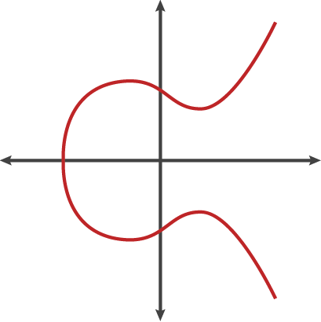
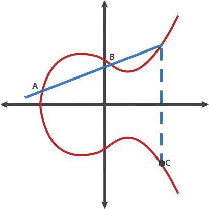
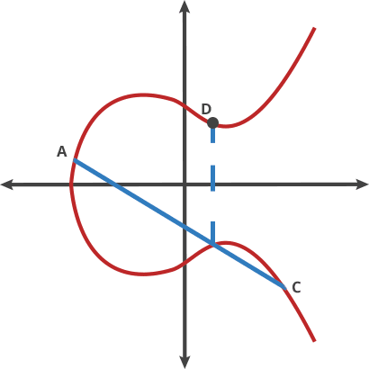
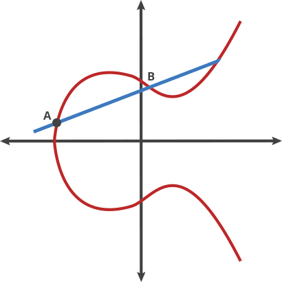

# ECC

ECC(Elliptic Curve Cryptography)

## ECC equation

The equation of an elliptic curve looks like this: \
\\(
  y^2=(x^3 +a*x +b) \pmod{p}
\\)

## ECC point add

* If the two points being added have different x-coordinates, then the line passing through the two points is used to find the point of intersection, which is then reflected over the x-axis to get the sum of the two points.
* If the two points being added are the same point, then the tangent line to the curve at that point is used to find the third point of intersection, which is then reflected over the x-axis to get the sum of the two points.
* If the two points being added have the same x-coordinate (symmetrical) but different y-coordinates, then the sum of the two points is the point at infinity.
* If one of the points being added is the point at infinity, then the sum of the two points is the other point being added.

**why chosen symmetrical point**: \
In ECC, when adding two points on a curve, it is possible that the result of the additon will be a point at infinity.When this happens, the result is still considered valid, but it is not useful for cryptographic operations. To avoid this situation,ECC use a symmetrical point for each point on the curve,such that when two points are added together, the resulting point is guaranteed to be on the curve. This is essential for the security and efficiently of ECC-based cryptographic protocols.

## The ECC used for cryptography

**curve order**: \
Rather than allow any value for the points on the curve, we restrict ourselves to whole numbers in a fixed range. In ECC, the size of the elliptic curve is determined by the number of points on the curve,which is denoted by a parameter called the "order" of the curve.The order of an elliptic curve is always a positive integer, and it represents the number of points on the curve, including the point at infinity.

**order must be a large prime number**: \
To ensure the security of ECC-based cryptographic protocols, the order of the curve must be a large prime number. This is because the security of ECC depends on the difficulty of solving the elliptic curve discreate logarithm problem (ECDLP, the trap door function of ECC),which is the problem of finding the intger k such that \\( Q=kP \\), where P and Q are points on the curve, and k is a secret integer.The larger the order of the curve, the more difficult it is to solve the ECDLP.

If the order of the curve is not a prime number, then it can be factored into smaller factors, which can be used to attack the curve and compromise the security of ECC-based cryptographic protocols.

The necessary and sufficient condition for the existence of a multiplicative inverse of b is that b is coprime with the modulus m.Let c be the inverse of b about modulus m,i.e., \\( b*c\equiv 1 \pmod{m} \\).

Explanation: \\( a/b=a/b\times1=(a/b)(b\times c)=a\times c \pmod{m} \\)

## ECC Encryption / Decryption In HTTPS

\\( Q_a=d_A*G \\)

**encrypt:**

generate random secret number: \\( k \\)

calc symmetric encryption key: \\( sk = k*Q_a \\)

calc the random point on curve: \\( R=k*G \\)  

export \\( (R, encryptedMsg) \\)

**decrypt:**

\\( sk=R*d_A \\), then use sk to decrypt the encryptedMsg.

**explanation:**

\\( sk=k\*Q_a=k\*d_A\*G=R*d_A \\)

## How to calc the public key of ECC

The double-and-add method is an efficient algorithm for computing scalar multiplication on an elliptic curve,and is commonly used for calculating the public key in elliptic curve cryptography.The algorithm proceeds as follows:

* Initialize a point Q to the point at infinity on the curve.
* Convert the scalar k to its binary representation.
* For each bit i in the binary representation of k, starting from the most significant bit:
  * Double the current value of Q.
  * if the i-th bit of k is 1, add P to the current value of Q.
* The final value of Q is the result of the scalar multiplication of P by k.

## ECC sign

**Signing the message:**

* Hash the message usinga cryptographic function to generate a fixed-length digest, denote as \\(h\\).
* Generate a random number \\(k\\), which is kept secret.
* Calculate a point R on the elliptic curve: \\(R=k\*G\\).
* Calculate a scalar: \\( s=k^{-1}(h+d_A\*r) \\), r is the x coordinate of R.
* The signature is the pair: \\((r,s)\\).

**Verifying the signature:**

* Hash the message using the same cryptographic hash function used to sign the message, denote as \\(h\\).
* Calculate a Point \\(P=s^{-1}\*h\*G+ s^{-1}\*r\*Q_a \\)
* If the x coordinate of P and R is equal, that means the signature is valid.

**explanation:**

we have: \\( P=s^{-1}\*h\*G + s^{-1}\*R\*Q_a \\)    \
but \\( Q_a=d_A\*G \\)    \
so \\( P=s^{-1}\*h\*G + s^{-1}\*r\*d_A\*G= s^{-1}(h+d_A\*r)\*G \\)    \
But the x coordinate of P must match R and r is the x coordinate of k*G, which means that: \
\\( k\*G=s^{-1}(h+d_A\*r)*G \\)    \
we can simplify by removing G which gives us: \
\\( k=s^{-1}(h+d_A\*r) \\)    \
by inverting k and S, we get: \
\\( s=k^{-1}(h+d_A\*r) \\)    \
and that is the equation used to generate the signature. so it matchs.

## Why Ethereum use signature(r,s,v)

Ethereum add additional v to recovery a unique public key.

In the verifying step, we have: \\(P=s^{-1}\*h\*G + s^{-1}\*r\*Q_a \\)  \
as P must match R : \\( R=s^{-1}\*h\*G + s^{-1}\*r\*Q_a \\)  \
\\( s\*R= h\*G + r\*Q_a \\)  \
\\( s\*R-h\*G=r\*Q_a \\)    \
\\( sr^{-1}\*R - hr^{-1}\*G=Q_a \\) \

the equation of seckp256k1 is: \\( y^2=x^3+7 \\), so R may have two points which was symmetrical of x-axis.Thus, Ethereum use v to define use positive R or negative R.

## References

* [Understanding-how-ECDSA-protects-your-data](https://www.instructables.com/Understanding-how-ECDSA-protects-your-data/)
* [noble-secp256k1](https://github.com/paulmillr/noble-secp256k1)
