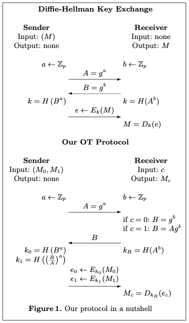

# Oblivious Transfer

Oblivious transfer (OT) is a cryptographic protocol that allows one party to securely tranfer information to another party without revealing any information about the transfered data to the other party.

In an OT protocol, there are two parties: a sender(Alice) and a receiver(Bob). Alice has a set of messages(for example, 0 and 1), and Bob wants to obtain one of the messages without Alice learning which message he chose. The goal is to ensure that Bob gets one of the message with a 50/50 chance, while Alice remains oblivious to which message Bob received.

## 1 out of 2 OT

## 1 out of n OT

* Setup(only once):
  * Sender samples \\( y \in Z_p \\) and compute \\( S=y\cdot G , T=y\cdot S \\)
  * Sender sends S to receiver, who aborts if \\( S \notin \mathbb{G} \\)
* Choose
  * Receiver samples \\( x \in Z_p \\) compute \\( R=c \cdot S+x\cdot G \\)
  * Receiver send R to sender, who aborts if \\(R \notin \mathbb{G} \\)
* Key Derivation:
  * For all \\( j \in [n] \\), sender computes
    \\[ k_j=Hash(yR-jT) \\]
  * Receiver computes
    \\[ k_R=Hash(xS) \\]
* Transfer:
  * For all \\( j \in [n] \\), sender computes \\( e_j= E(k_j, M_j)\\)
  * Sender sends \\( (e_0, e_1, \dots , e_{n-1}) \\) to receiver
* Retrieve:
  * Receiver computes \\( M=D(k_R, e_c) \\)

**Proof:**    \
\\( yR-jT=y(cS+xG)-j(yS) \\)    \
\\( =cy^2G+xyG-jy^2G \\)    \
\\( =(c-j)y^2G + xyG \\)    \

\\( xS=xyG \\)

## References

* [The Simplest Protocol for Oblivious Transfer](https://eprint.iacr.org/2015/267.pdf)
