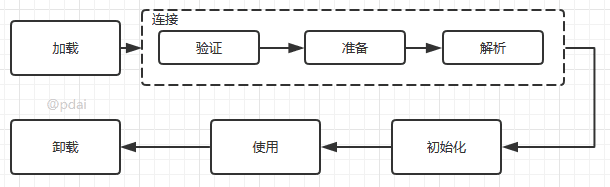

# JVM


**程序计数器:** 程序计数器用来记录当前正在执行的**字节码指令**的地址，程序计数器只存了一个地址。当一条指令执行完成后，程序计数器就会自动加1，指向下一条要执行的指令的地址，或者跳转到下一条要执行的指令的地址。

* CPU会在各个线程间不停地进行切换，当恢复执行时通过程序计数器就知道下一条指令应该执行什么。如果当前线程正在执行的是Java方法，程序计数器记录的是JVM字节码指令地址，如果是执行native方法，则是未指定(undefined)。
* Java控制逻辑需要依赖程序计数器来完成，比如分支，循环，跳转，异常处理，线程恢复等。

**堆区内存分为:**

1. 新生代 (年轻代)：新对象和没达到一定年龄的对象都在新生代
2. 老年代：被长时间使用的对象，老年代代内存空间应该要比年轻代更大

## JVM 参数

* -Xms7000m 设置堆内存初始大小为7000M
* -Xmx7000m 设置堆内存最大为7000M
* -Xmn2000m 设置堆内存的 young 区大小为2000M
* -Xss256k  设置每个线程的 stack 的大小为256k
* -XX:MetaspaceSize=N 设置元空间初始大小
* -XX:MaxMetaspaceSize=N 设置元空间最大值
* -XX:PretenureSizeThreshold 大于此值的对象直接分配在老年代，避免在 Eden 区和 Suvivior中频繁进行复制
* -XX:MaxTenuringThreshold 年龄达到MaxTenuringThreshold就会进入老年代

## GC

当前主流VM垃圾收集采用分代收集(generational collection)法,根据对象的存活周期，将内存分为几个不同的分区，比如JVM的 新生代，老年代。

* 新生代-复制法


> 将内存划分为大小相等的两块，每次只使用其中一块，当这一块内存用完了就将还存活的对象复制到另一块上面，然后再把使用过的内存空间进行一次清理。\
> \
> 现在的商业虚拟机都采用复制法来回收新生代，但是并不是将新生代划分为大小相等的两块，而是分为一块较大的 Eden 空间和两块较小的 Survivor 空间，每次使用 Eden 空间和其中一块 Survivor。在回收时，将 Eden 和 Survivor 中还存活着的对象一次性复制到另一块 Survivor 空间上，最后清理 Eden 和使用过的那一块 Survivor。\
> \
> HotSpot 虚拟机的 Eden 和 Survivor 的大小比例默认为 8:1，保证了内存的利用率达到 90%。如果每次回收有多于 10% 的对象存活，那么一块 Survivor 空间就不够用了，此时需要依赖于老年代进行分配担保，也就是借用老年代的空间存储放不下的对象。

* 老年代-标记整理算法


> 让所有存活的对象都向一端移动，然后直接清理掉端边界以外的内存。

## Minor-GC, Major-GC, Full-GC

* Minor-GC 又叫 Young-GC，只进行新生代的垃圾收集
* Major-GC 又叫 Old-GC， 只进行老年代的垃圾收集
* Full-GC，对全堆进行垃圾收集

## Full GC的触发条件

* 主动调用 System.gc()
* 老年代空间不够
  * 大对象直接进入老年代或者长期存活的对象进入老年代导致老年代空间不够
  * 使用复制算法的 minor GC 需要老年代的内存空间做担保，如果担保失败回执行 Full GC

## 查看java使用的GC

```text
java -XX:+PrintCommandLineFlags -version
-XX:InitialHeapSize=268435456 -XX:MaxHeapSize=4294967296 -XX:+PrintCommandLineFlags -XX:+UseCompressedClassPointers -XX:+UseCompressedOops -XX:+UseParallelGC 
openjdk version "1.8.0_362"
OpenJDK Runtime Environment (Zulu 8.68.0.21-CA-macos-aarch64) (build 1.8.0_362-b09)
OpenJDK 64-Bit Server VM (Zulu 8.68.0.21-CA-macos-aarch64) (build 25.362-b09, mixed mode)

-XX:+UseParallelGC 表示 java8 使用的是 ParallelGC
```

```text
java -XX:+PrintGCDetails -version
openjdk version "1.8.0_362"
OpenJDK Runtime Environment (Zulu 8.68.0.21-CA-macos-aarch64) (build 1.8.0_362-b09)
OpenJDK 64-Bit Server VM (Zulu 8.68.0.21-CA-macos-aarch64) (build 25.362-b09, mixed mode)
Heap
 PSYoungGen      total 76288K, used 2621K [0x000000076ab00000, 0x0000000770000000, 0x00000007c0000000)
  eden space 65536K, 4% used [0x000000076ab00000,0x000000076ad8f748,0x000000076eb00000)
  from space 10752K, 0% used [0x000000076f580000,0x000000076f580000,0x0000000770000000)
  to   space 10752K, 0% used [0x000000076eb00000,0x000000076eb00000,0x000000076f580000)
 ParOldGen       total 175104K, used 0K [0x00000006c0000000, 0x00000006cab00000, 0x000000076ab00000)
  object space 175104K, 0% used [0x00000006c0000000,0x00000006c0000000,0x00000006cab00000)
 Metaspace       used 2277K, capacity 4480K, committed 4480K, reserved 1056768K
  class space    used 244K, capacity 384K, committed 384K, reserved 1048576K
```

## JVM Ergonomics

不需要设置堆内存，新生代内存等。JVM会根据机器配置和日志自动动态调整JVM等各种内存尺寸。针对一些特殊场景通过设置 MaxGCPauseMillis,GCTimeRatio 这种 goal 就好，更加地符合人体工学。

## GC roots

现在的虚拟机一般都采用可达性分析算法来判断对象是否存活，可达性算法的原理是从一堆叫做 GC roots 的节点出发，遍历它们的子节点。这样可以得到一颗颗的引用树，遍历完毕之后，如果某些对象不在引用树中，那么这些对象就会被视为垃圾，可以被回收。

### 如果一个对象可以被回收，就一定会被回收吗？

答案是否定了，如果一个对象可以被回收，还会执行一下这个对象的 finalize 方法，如果在 finalize 方法里面时对象链接到引用树上，这个对象就不会被回收了。finalize 方法只会被执行一次。

### 哪些对象可以做 GC roots 呢

* 虚拟机栈中引用的对象(还在执行的方法引用的对象)
* 本地方法栈中jni引用的对象(还在执行的Native方法引用的对象)
* 元空间中静态属性引用的对象(静态属性引用的对象)
* 元空间中常量引用的对象(常量引用的对象)

## JVM OOM可能发生的区域

JVM可能发生OOM的地方，可以总结为除了程序计数器(只存了一个地址，不会溢出)外，其他地方都有可能OOM.

* 堆内存
* 虚拟机栈，本地方法栈
* 直接内存
* 元空间

## Java类加载机制

Java类的生命周期如下图所示：


**验证：**

* 验证class文件是否以0xCAFEBABE开头，主次版本号是否在当前虚拟机的处理范围，常量池中的常量是否有不被支持的类型。
* 对字节码的语义信息进行分析，判断是否符合Java语言规范的要求。
* 通过数据流和控制流分析，确保语义是合法、符合逻辑的。
* 验证符号引用引用，确保解析动作能够正确执行。

**准备：** 为静态变量在meta space分配内存，并将其初始化为数据类型的零值。

**解析：** 解析是将常量池内的符号引用替换为直接引用的过程。直接引用就是直接指向目标的指针。

Java类的加载过程如下：

* 通过一个类的完全限定名来获取其.class二进制字节流
* 将这个字节流所代表的静态存储结构转化为元空间的运行时数据结构
* 在Java堆中生成一个代表这个类的java.lang.Class对象(我们常用clazz表示)，作为对元空间中这个的类的元数据访问的引用


上面的加载过程可以自定义类加载器，从网络中获取类的.class文件。一般自定义加载器用来加载加密的类。防止代码被反编译。

* 自定义类加载器只需要继承 ClassLoader抽象类，然后重写 findClass 方法即可。
* 最好不要重写loadClass方法，因为这样容易破坏双亲委派模式

**双亲委派的流程和好处：**

JVM的类加载器从根节点开始依次为 BootStrapClassLoader -> ExtClassLoader -> AppClassLoader. \
BootStrapClassLoader 主要用来加载 java.*开头的类库。\
ExtClassLoader 主要用来加载 javax.* 开头的类库。\
AppClassLoader 用来加载用户自己写的类。\

双亲委派的过程就是一个类加载器在加载一个class时，它首先不会自己去尝试加载这个class,而是一级级地向上传递给父加载器尝试，到了根加载器如果没有加载成功，再一级级地向下传递给子加载器尝试。

双亲委派机制主要是为了去重，在类加载过程中不要重复加载一个类。在JVM中，如果类的完全限定名相同，但是被不同的类加载器加载的class文件，会被认为是两个不同的类。在JVM中，一个类的唯一标识是**类加载器+类名**，这也就是为什么在有类缓存机制的条件下，仍然需要双亲委派机制。

## 自定义类加载器的使用场景

* 用自定义类加载器实现Java类的隔离，比如tomcat使用不同的类加载器实例来加载不同的war包，这种情况下需要重写loadClass()方法为应用类打破双亲委派机制。
* 加载远程类的实现，比如从网络中下载加密后的class文件进行加载，防止代码被反编译。

## References

* [知乎：你知道JVM方法区是干什么用的吗](https://zhuanlan.zhihu.com/p/166190558)
* [oracle: Java8 Ergonomics gctuning](https://docs.oracle.com/javase/8/docs/technotes/guides/vm/gctuning/ergonomics.html#ergonomics)
* [GC Roots 是什么？哪些对象可以作为 GC Root？看完秒懂](https://blog.csdn.net/weixin_38007185/article/details/108093716)
* [JVM相关知识体系详解](https://pdai.tech/md/java/jvm/java-jvm-x-overview.html)
* [程序计数器工作原理](https://zhuanlan.zhihu.com/p/621308686)
* [Java自定义类加载器](https://juejin.cn/post/6844903705171476493)
* [自定义类加载器在tomcat中的应用](https://www.cnblogs.com/ITPower/p/15374926.html)
