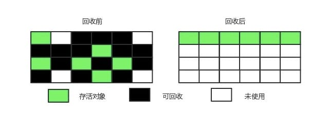

# JVM


堆区内存分为：

1. 新生代 (年轻代)：新对象和没达到一定年龄的对象都在新生代
2. 老年代：被长时间使用的对象，老年代代内存空间应该要比年轻代更大

## JVM 参数

* -Xms7000m 设置堆内存初始大小为7000M
* -Xmx7000m 设置堆内存最大为7000M
* -Xmn2000m 设置堆内存的 young 区大小为2000M
* -Xss256k  设置每个线程的 stack 的大小为256k
* -XX:MetaspaceSize=N 设置元空间初始大小
* -XX:MaxMetaspaceSize=N 设置元空间最大值
* -XX:PretenureSizeThreshold 大于此值的对象直接分配在老年代，避免在 Eden 区和 Suvivior中频繁进行复制
* -XX:MaxTenuringThreshold 年龄达到MaxTenuringThreshold就会进入老年代

## GC

当前主流VM垃圾收集采用分代收集(generational collection)法,根据对象的存活周期，将内存分为几个不同的分区，比如JVM的 新生代，老年代。

* 新生代-复制法


> 将内存划分为大小相等的两块，每次只使用其中一块，当这一块内存用完了就将还存活的对象复制到另一块上面，然后再把使用过的内存空间进行一次清理。\
> \
> 现在的商业虚拟机都采用复制法来回收新生代，但是并不是将新生代划分为大小相等的两块，而是分为一块较大的 Eden 空间和两块较小的 Survivor 空间，每次使用 Eden 空间和其中一块 Survivor。在回收时，将 Eden 和 Survivor 中还存活着的对象一次性复制到另一块 Survivor 空间上，最后清理 Eden 和使用过的那一块 Survivor。\
> \
> HotSpot 虚拟机的 Eden 和 Survivor 的大小比例默认为 8:1，保证了内存的利用率达到 90%。如果每次回收有多于 10% 的对象存活，那么一块 Survivor 空间就不够用了，此时需要依赖于老年代进行分配担保，也就是借用老年代的空间存储放不下的对象。

* 老年代-标记整理算法



> 让所有存活的对象都向一端移动，然后直接清理掉端边界以外的内存。

## Minor-GC, Major-GC, Full-GC

* Minor-GC 又叫 Young-GC，只进行新生代的垃圾收集
* Major-GC 又叫 Old-GC， 只进行老年代的垃圾收集
* Full-GC，对全堆进行垃圾收集

## Full GC的触发条件

* 主动调用 System.gc()
* 老年代空间不够
  * 大对象直接进入老年代或者长期存活的对象进入老年代导致老年代空间不够
  * 使用复制算法的 minor GC 需要老年代的内存空间做担保，如果担保失败回执行 Full GC

## 查看java使用的GC

```text
java -XX:+PrintCommandLineFlags -version
-XX:InitialHeapSize=268435456 -XX:MaxHeapSize=4294967296 -XX:+PrintCommandLineFlags -XX:+UseCompressedClassPointers -XX:+UseCompressedOops -XX:+UseParallelGC 
openjdk version "1.8.0_362"
OpenJDK Runtime Environment (Zulu 8.68.0.21-CA-macos-aarch64) (build 1.8.0_362-b09)
OpenJDK 64-Bit Server VM (Zulu 8.68.0.21-CA-macos-aarch64) (build 25.362-b09, mixed mode)

-XX:+UseParallelGC 表示 java8 使用的是 ParallelGC
```

```text
java -XX:+PrintGCDetails -version
openjdk version "1.8.0_362"
OpenJDK Runtime Environment (Zulu 8.68.0.21-CA-macos-aarch64) (build 1.8.0_362-b09)
OpenJDK 64-Bit Server VM (Zulu 8.68.0.21-CA-macos-aarch64) (build 25.362-b09, mixed mode)
Heap
 PSYoungGen      total 76288K, used 2621K [0x000000076ab00000, 0x0000000770000000, 0x00000007c0000000)
  eden space 65536K, 4% used [0x000000076ab00000,0x000000076ad8f748,0x000000076eb00000)
  from space 10752K, 0% used [0x000000076f580000,0x000000076f580000,0x0000000770000000)
  to   space 10752K, 0% used [0x000000076eb00000,0x000000076eb00000,0x000000076f580000)
 ParOldGen       total 175104K, used 0K [0x00000006c0000000, 0x00000006cab00000, 0x000000076ab00000)
  object space 175104K, 0% used [0x00000006c0000000,0x00000006c0000000,0x00000006cab00000)
 Metaspace       used 2277K, capacity 4480K, committed 4480K, reserved 1056768K
  class space    used 244K, capacity 384K, committed 384K, reserved 1048576K
```

## JVM Ergonomics

不需要设置堆内存，新生代内存等。JVM会根据机器配置和日志自动动态调整JVM等各种内存尺寸。针对一些特殊场景通过设置 MaxGCPauseMillis,GCTimeRatio 这种 goal 就好，更加地符合人体工学。

## References

* [知乎：你知道JVM方法区是干什么用的吗](https://zhuanlan.zhihu.com/p/166190558)
* [oracle: Java8 Ergonomics gctuning](https://docs.oracle.com/javase/8/docs/technotes/guides/vm/gctuning/ergonomics.html#ergonomics)
