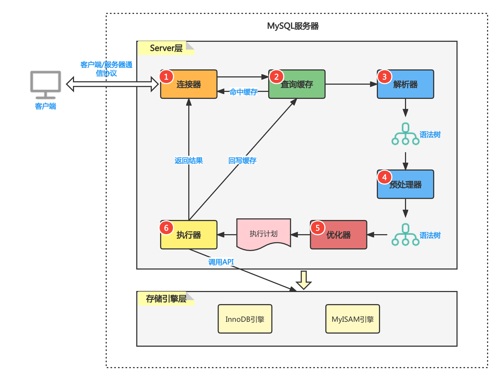

# MySQL

## MySQL索引为什么选择B+树

数据库查询数据的瓶颈主要在于磁盘IO,磁盘IO有个特点，就是从磁盘读取1B数据和1KB数据所消耗的时间基本是一样的。而mysql又经常有range query的需求，所以索引最好要对range query友好。

其次是mysql的主键一般都是自增的，如果使用**二叉搜索树**就会导致树的结构退化成链表。


B+树的非叶子结点存储的是索引，叶子结点存储的是真正的数据。单个非叶子结点可以存储大量的索引，从而降低树的高度，减少磁盘IO的次数。其次是叶子节点的链表本省就是有序的，在进行范围查找时，很高效。

**MyISAM 和 Innodb 索引对比：**\

MyISAM在建表时以主键作为KEY来建立B+索引树，树的叶子节点存储的是对应数据的物理地址。会把索引存储在 MYI(MyISAM index)文件中，把数据存储在 MYD(MyISAM data)文件中。

Innodb在建表时以主键作为KEY来建立B+索引树，树的叶子节点存储的时具体的数据。当我们为某个字段创建索引时，以该字段作为KEY来创建B+树，树的叶子节点存储的时主键。所以Innodb在进行非 primary index 的索引查询时，第一次拿到的是主键，然后再去主键的B+树查询具体的数据。

## 事务隔离

* 脏读

> 脏读就是读到了其他事务未提交的数据，未提交就意味着可能会回滚。读到了最终不存在的数据，这就是脏读。

* 可重复读

> 可重复读是指在一个事物的开始和结束之间的任意时刻，重复读到的同一批数据都是一致的。通常用于基于读到的某一个条件进行**更新**。

* 不可重复读

> 不可重复读是指在一个事务内，不同时刻读到的同一批数据是不一样的。可能受其他事务影响，比如其他事务更新了数据，并且提交了事务。

* 幻读

> 幻读主要由**插入**操作导致。比如用户A把所有status=-1的记录都都删除了，但是没有提交事务。这个时候用户B新插入一条status=-1的记录，然后提交了事务。当用户A这个时候去查询status=-1的记录，就会发现很魔幻，刚刚不是删了吗，怎么还能查询到。

|隔离级别|脏读|不可重复读|幻读|
|:-:|:-:|:-:|:-:|
|读未提交|可能|可能|可能|
|读提交|不可能|可能|可能|
|可重复读|不可能|不可能|可能|
|串行化|不可能|不可能|不可能|

## 隔离的实现原理

* 读未提交

> 什么也不做，没有隔离

* 串行化

> 串行化读的时候加的是共享锁,也就是其他事务可以并发读，但是不能写。写的时候加的是排它锁，其他事务不能读也不能写。

* 可重复读和读提交

> 为了实现可重复读，Mysql才用了**多版本并发控制**的方法。数据库表中的一行记录会存在多个版本，每个版本除了有自身的数据之外，还有一个标识版本的字段，记为 row tx_id, 这个字段就是就是产生这个记录的的事务的id。 事务的id按照申请的时间递增。
> \
> 可重复读会在事务开始的时候创建一个快照，而读提交在每条sql执行之前都会重新创建快照。

对于一个快照来说，读取数据的规则如下

```text
1. 当前事务内的更新，可以读到
2. 创建快照时已经提交的版本，可以读到
3. 创建快照时未提交的版本，不能读到
```

## 并发写加锁规则

加锁的过程分为有索引和没有索引两种情况：\
当要更新的数据是根据索引来查找的，直接给找到的数据添加上**行锁**。\
当要更新的数据不是通过索引来查找的，mysql会给这张表中的**所有行加行锁**，然后进行过滤，发现不满足查询条件的行，就把行锁给解开。最终只有符合条件的行被添加了行锁。所以，如果是大表的话，需要为更新时的查找字段添加索引，不然加锁再解锁对性能的消耗很大。

## MySQL的可重复读通过（行锁+间隙锁）解决了幻读

MySQL的索引采用的是B+树，B+树的叶子节点就是一条有序的链表。所以我们只需要对要更新数据添加行锁，然后对需要更新数据的**左子区间**，**右子区间**添加上间歇锁，那么在事务执行期间新插入的数据就一定不会落在我们的条件区间内，从而解决了幻读。

## B+树 vs 跳表

B+树的每个节点存储了多个数据，跳表一个节点只存一个数据，所以B+树更加扁平。B+树一个节点可以存储16kb的数据,扇出高，假设层高对应磁盘IO,那么B+树对读性能就比跳表要好。但因为B+树本质是一颗多叉平衡树，在插入的过程中需要进行平衡操作，效率低。

跳表的下一层的节点数量在数学期望上是上一层的两倍，这样查询效率正好符合 $\log{(n)}$, 所以跳表在插入数据时使用了一个随机函数来决定是否需要在上面的层创建索引。跳表插入时局部性更强(需要更新的节点少)，效率高。Redis 的 ZSET 就是使用跳表来存储的，因为Redis的读写操作都在内存完成，层高的问题就不再是劣势了。

B+树和跳表的叶子节点都是有序链表，在进行范围查找和全表扫描时，效率高。

## 一条sql语句在MySQL是如何执行的



MySQL的server包含**连接器，查询缓存，解析器，预处理器，优化器，执行器**等模块。

一个查询语句过来，如果缓存是打开的，会先去缓存查询数据，mysql的缓存是一张hash table, key 就是 sql语句。mysql的缓存很鸡肋，每一个更新操作都会使得整张表的查询缓存失效，缓存命中率极低，除非你的表是一张基本不更新的静态表，缓存命中率才高。因为太鸡肋，mysql8直接把缓存功能给删除了。 解析器进行词法分析和语法分析； 预处理器判断解析树中的表名列名是否存在，用户权限是否符合ACL; 优化器进行sql语句的优化，比如可以通过将查询语句修改顺序来匹配联合索引的最左前缀规则；执行器按行从innodb引擎获取数据；
最后执行器把数据返回给客户端。

如果是更新语句，还需要写日志模块。mysql自带binlog(归档日志)， MyISAM和Innodb都可以使用，额外地，Innodb还有一个 redo log用来支持事务。

redo log两阶段提交：

Innodb在内存更新数据后先记录redo log为prepare状态，然后告诉执行器，执行器记录binlog, 然后再提交redo log为commit状态。
基于两阶段提交，在异常恢复时，可以保证数据的一致性：

* 判断redo log是完整的，立即commit.
* 如果redo log时prepare状态，判断binlog是否完整，如果binlog完整就提交redo log，不然就回滚事务。

## mysql联合索引的数据结构，为什么会有最左匹配原则

假设我们有一个联合索引(a,b,c),相当于创建了 (a),(a,b),(a,b,c) 三个索引，构造的B+树叶子节点中a是单调递增的，b只有在a相等的情况下才单调递增，c只有在a,b相等的情况下才单调递增。所有联合索引在进行查询时，只有满足最左原则，索引才会生效。

## References

* [知乎：深入理解Mysql索引底层原理](https://zhuanlan.zhihu.com/p/113917726)
* [知乎: MySQL事务隔离级别和实现原理（看这一篇文章就够了！）](https://zhuanlan.zhihu.com/p/117476959)
* [B+树 vs 跳表](https://www.51cto.com/article/706701.html)
* [一条sql语句在MySQL是如何执行的,包括查询和更新](https://juejin.cn/post/6844903801694978061)
* [从MySQL架构看一条SQL语句是如何执行的？: 只介绍了查询](https://blog.csdn.net/rongtaoup/article/details/125784323)
* [联合索引在B+树上的存储结构及数据查找方式](https://juejin.cn/post/6844904073955639304)
