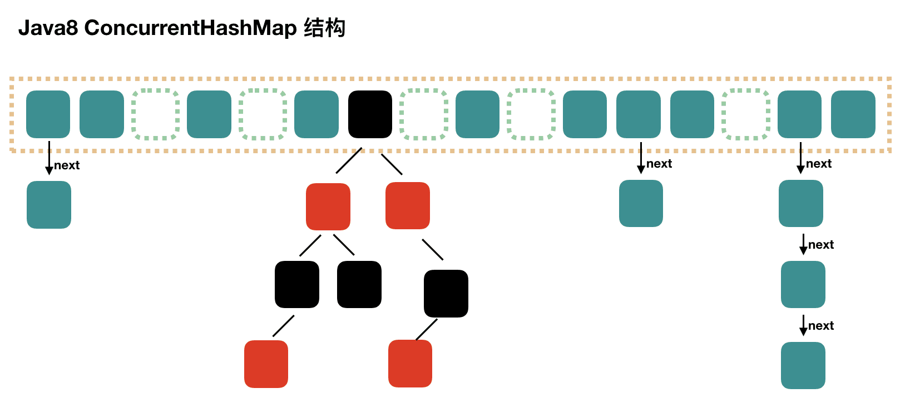

# Parallel

在 Java 的设计理念下，多个线程之间通过共享内存来进行交流。在同一个 JVM runtime 中，所有的线程共享**堆内存**，每个线程拥有自己的**栈内存**用于存储本地变量和方法参数。

## BackPressure 线程池的创建

```java
ExecutorService的创建函数方法为： ThreadPollExecutor(
    int corePoolSize,
    int maximumPoolSize,
    long keepAliveTime,
    TimeUnit unit,
    BlockingQueue<Runnable> workQueue,
    ThreadFactory threadFactory,
    RejectedExecutionHandler handler
)

创建实例代码：
        LinkedBlockingQueue<Runnable> queue = new LinkedBlockingQueue<>(4);
        ExecutorService executorService = new ThreadPoolExecutor(4, 4, 60, TimeUnit.SECONDS, queue, Executors.defaultThreadFactory(), new ThreadPoolExecutor.CallerRunsPolicy());

1. 首先创建一个有界队列，Executors默认实现使用无界队列，会导致内存耗尽；
2. 背压的核心是CallerRunsPolicy,当线程池maxPoolSize满时，由调用线程池的线程去执行Runnable，可以阻塞调用者继续提交Runnable；

线程池的执行过程如下：
 有任务来时，创建线程执行->
 线程数量达到corePoolSize时，新任务进入workQueue队列等待->
 当workQueue满时，创建新线程来执行任务->
 当线程数量达到maximumPoolSize时，调用handler执行拒绝策略；

可以简化为： 核心池满->入队列->队列满->继续创键新线程->线程数量达到最大池限制->执行拒绝策略


ExecutorService.shutdown()，调用shutdown后线程池不在接受新的任务，不过正在执行的和进入到队列的都会执行完毕以后才会关闭；
ExecutorService.isTerminated(),用来检测线程池是否已经关闭；

```

## Java的线程安全实现思路

1. 互斥同步(synchronized, ReentrantLock)
2. 非阻塞同步 (CAS, e.g. Atomic*)
3. 无同步方案 (栈封闭, ThreadLocal)

||锁的实现|性能|获取锁时可中断等待|公平锁|锁的Target|释放锁|
|:-:|:-:|:-:|:-:|:-:|:-:|:-:|
|synchronized|JVM|和ReentrantLock相当|不可以|非公平|单个对象|JVM负责释放|
|ReentrantLock|JDK|和synchronized相当|lock.tryLock(time,unit)|可以配置为公平|lock可以绑定多个condition对象|coder自己释放|

ReentrantLock的可重入性：重入性指的是任意线程在获取到锁之后能够再次获取该锁而不会被阻塞。ReentrantLock的实现原理和引用计数一样，获取锁就state++,释放锁就state--,state=0时锁就被释放掉了。

### wait 和 (sleep, yield) 的区别

wait是Object的方法，wait会释放掉monitor，直到notify,notifyAll线程才会被唤起；\
sleep和yield都是Thread的静态方法，都不会释放monitor。sleep一直等待中断信号；yield给操作系统一个“建议”，表示自身线程可以被调整为Runnable状态，操作系统可以不接受这个建议。

对应 (wait,notify,notifyAll), ReentrantLock也给Condition对象设计了一套 (await,signal,signalAll) 来进行线程之间的协作。

## Atomic* 原子类

volatile可以保证可见性，但是不能保证原子性； Lock,synchronized可以保证可见性，原子性，有序性，但是互斥锁机制性能不好。所以Java引入来Atomic*系列的原子类，原子类的底层原理为CAS+volatile.

原子类可以分为4组：

1. 基本类型
    * AtomicBoolean
    * AtomicInteger
    * AtomicLong
2. 引用类型
    * AtomicReference
    * AtomicMarkableReference
    * AtomicStampedReference
3. 数组类型
    * AtomicIntegerArray
    * AtomicLongArray
    * AtomicReferenceArray
4. 属性更新器类型
    * AtomicIntegerFieldUpdater
    * AtomicLongFieldUpdater
    * AtomicReferenceFieldUpdater

AtomicMarkableReference使用一个布尔值作为标记，修改时在 true/false 之间切换。这种策略不能从根本上解决ABA问题，只能降低ABA问题发生的概率。AtomicStampedReference通过添加一个版本号，彻底解决了ABA问题。

Atomic{*}Array是基本类型的数组版本，数组原子类为 **数组元素** 提供了 volatile 类型的访问语义。

属性更新器类型支持基于反射机制更新一个类的字段值的原子操作，被更新的字段必须标识为volatile类型。

## HashMap 与 ConcurrentHashMap

HashMap的结构：数组+链表+红黑树


求key的hash:

```java
   static final int hash(Object key) {
        int h;
        return (key == null) ? 0 : (h = key.hashCode()) ^ (h >>> 16);
    }

  将hash的高16位和低16做异或运算，这样hash的高位不变，低位根据高位信息变化，
  目的是增强hash的随机性，降低hash冲突的概率。
```

求entry item在数组的索引:

```java
  i = (n - 1) & hash // JDK8 HashMap putVal 631行

  这里的n是数组的长度，n为2的幂次。
  这里用了一个技巧来计算索引，一般我们计算完hash，直接用 hash (mod n) 就可以做索引了。
  因为n为2的幂次，n-1的二进制就全为1，(n-1) & hash 就和 hash (mod n) 等价，按位与比取模效率高。
```

执行写入操作:

```java

    /**
     * Implements Map.put and related methods.
     *
     * @param hash hash for key
     * @param key the key
     * @param value the value to put
     * @param onlyIfAbsent if true, don't change existing value
     * @param evict if false, the table is in creation mode.
     * @return previous value, or null if none
     */
    final V putVal(int hash, K key, V value, boolean onlyIfAbsent,
                   boolean evict) {
        Node<K,V>[] tab; Node<K,V> p; int n, i;

        if ((tab = table) == null || (n = tab.length) == 0)
            n = (tab = resize()).length;

        // 如果数组在 index=i 处为空，直接把 node 写入数组
        if ((p = tab[i = (n - 1) & hash]) == null)
            tab[i] = newNode(hash, key, value, null);
        else {
            Node<K,V> e; K k;
            // 如果数组在 index=i 的 node hash 和 key 都和待插入的 entry item 一致，做更新操作
            if (p.hash == hash &&
                ((k = p.key) == key || (key != null && key.equals(k))))
                e = p;
            // 如果 p 为红黑树节点，执行红黑树插入
            else if (p instanceof TreeNode)
                e = ((TreeNode<K,V>)p).putTreeVal(this, tab, hash, key, value);
            // 执行链表插入
            else {
                for (int binCount = 0; ; ++binCount) {
                    if ((e = p.next) == null) {
                        // 插入node到链表
                        p.next = newNode(hash, key, value, null);
                        // 判断链表长度是否大于8，大于8就将链表转为红黑树
                        if (binCount >= TREEIFY_THRESHOLD - 1) // -1 for 1st
                            treeifyBin(tab, hash);
                        break;
                    }
                    if (e.hash == hash &&
                        ((k = e.key) == key || (key != null && key.equals(k))))
                        break;
                    p = e;
                }
            }
            if (e != null) { // existing mapping for key
                V oldValue = e.value;
                if (!onlyIfAbsent || oldValue == null)
                    e.value = value;
                afterNodeAccess(e);
                return oldValue;
            }
        }
        ++modCount;
        // threshold= array_capacity * load_factor, 超过阈值，扩容
        if (++size > threshold)
            resize();
        afterNodeInsertion(evict);
        return null;
    }

-----------------------------------------------
    扩容也用一个巧妙的技巧，扩容时数组容量翻倍，重写计算 node 在数组的 index.
    同一个链表中的node会被拆分成两部分，一部分继续在当前 index 存储，称为“低位”部分；
    另外一部分存储在 index+oldCap 的索引位置上，称为“高位”部分。

    if ((e.hash & oldCap) == 0) // 存储在低位
    else // 存储在高位
    
    还是因为 capacity 是2的幂次的原因，扩容就是把 hash 和 new_capacity 的最高位相同的 item 移动到 “高位”部分。

    综合以上信息，HashMap 的 capacity 选择为2的幂次的原因就是为了在计算数组索引时(正常计算，扩容时计算)获得高性能。
```

### ConcurrentHashMap

JDK 1.7 的 ConcurrentHashMap 由一个个的 segment 组成，每个segment的元素类似HashTable, segment 通过集成 ReentrantLock 来进行加锁，所以 JDK 1.7 的 ConcurrentHashMap 的并发度最高只能为 16（默认的segment数量）。

JDK 1.8 的 ConcurrentHashMap 采用与 HashMap 相似的（数组+链表+红黑树）来实现，而加锁则是通过 CAS+synchronized实现。

## References

* [全面了解Java原子变量类](https://www.cnblogs.com/jingmoxukong/p/12109049.html)
* [Java全栈知识体系](https://pdai.tech/md/java/thread/java-thread-x-thread-basic.html)
* [详解HashMap数据结构](https://juejin.cn/post/6844904111817637901)
