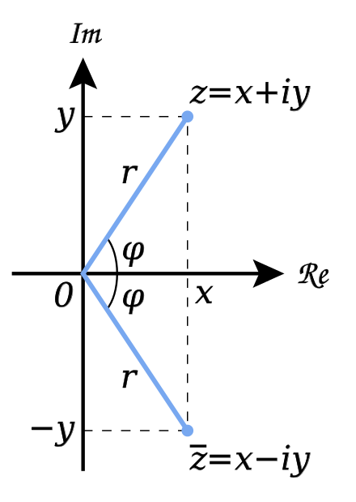

# 快速傅立叶变换(Fast Fourier Transform)

## 复数的几何表示法

复数通过**复平面**来表示，复平面由水平的实轴和垂直的虚轴构成。一个复数的实部用沿x轴的位移表示，虚部用沿y轴的位移表示。上图中的复数$z=x+iy $ 也可以写做 $z=r(\cos{\varphi}+ i\sin{\varphi}) $, 如果r=1(单位圆)，则 $z=\cos{\varphi} + i\sin{\varphi} $。

## 欧拉公式 (Euler's formula)

欧拉公式的作用是**复分析**领域的函数，它将三角函数与复指数函数关联起来。对任意的**实数** x，都存在
$$e^{ix}=\cos{x} + i\sin{x} $$
其中e是自然对数的底数，i是虚数单位。

## 单位根

将一个单位圆进行n等分，在单位圆上可以得到n个复数，设幅角为正且最小的复数为$\omega_n $, 称为 **n次单位根**，即
$$\omega_n=\cos{\frac{2\pi}{n}} + \sin{\frac{2\pi}{n}} $$
根据欧拉公式有
$$\omega_n^k= \cos{\frac{2k\pi}{n}} + i\sin{\frac{2k\pi}{n}} $$
特别地
$$\omega_n^0=\omega_n^n=1 $$

## 快速傅立叶变换

对于多项式$f(x)=\sum_{i=0}^n a_i x^i, g(x)=\sum_{i=0}^n b_i x^i $， 定义其乘积 fg 为
$$ (fg)(x)=(\sum_{i=0}^n a_i x^i)(\sum_{i=0}^n b_i x^i) $$
显然我们可以以$O(n^2) $的复杂度计算这个乘积的每一项的系数。\
但 FFT 可以以 $O(n\log n) $的复杂度来计算这个乘积。

对多项式$f(x)=\sum_{i=0}^{n-1} a_ix^i $ ,不失一般性地设 $n=2^s, s\in N $,按照 $a_i$ 下标的奇偶性将 $f(x)$ 中的项分为两部分，即
$$\begin{align}
f(x) &=(a_0+a_2x^2+a_4x^4+\cdots+a_{n-2}x^{n-2}) \\
     &+(a_1x+a_3x^3+a_5x^5+\cdots+a_{n-1}x^{n-1}) \\
\end{align}
$$
令
$$
f_1(x)=a_0+a_2x^1+a_4x^2+\cdots+a_{n-2}x^{\frac{n}{2}-1} \\
f_2(x)=a_1+a_3x+a_5x^2+\cdots+a_{n-1}x^{\frac{n}{2}-1}
$$
则
$$f(x)=f_1(x^2)+xf_2(x^2) $$

代入$x=\omega_n^k, (k<\frac{n}{2}) $可得
$$\begin{align}
f(\omega_n^k) &=f_1(\omega_n^{2k}) + \omega_n^k f_2(\omega_n^{2k}) \\
&= f_1(\omega_{\frac{n}{2}}^k) + \omega_n^k f_2(\omega_{\frac{n}{2}}^k)
\end{align}
\qquad(1)
$$

代入$x=\omega_n^{k+\frac{n}{2}} $可得
$$\begin{align}
f(\omega_n^{k+\frac{n}{2}}) &= f_1(\omega_n^{2k+n}) + \omega_n^{k+\frac{n}{2}} f_2(\omega_n^{2k+n}) \\
&= f_1(\omega_{\frac{n}{2}}^k) - \omega_n^k f_2(\omega_{\frac{n}{2}}^k)
\end{align}
\qquad(2)
$$

观察(1),(2)两式的结构，我们只需要求出$f_1(\omega_{\frac{n}{2}}^k), f_2(\omega_{\frac{n}{2}}^k) $即可在$O(1) $复杂度求出(1),(2)两式的值，进而再经过类似的步骤，我们可以将问题转化为求 $f_1(\omega_{\frac{n}{4}}^k),f_2(\omega_{\frac{n}{4}}^k) \cdots $，最终问题被转化为求
$$f_1(\omega_1^k)=f_2(\omega_1^k)=1 $$
故而以$O(\log n) $的时间复杂度可以求出 $f(\omega_n^k), f(\omega_n^{k+\frac{n}{2}}) $，进而可以以$O(n\log n) $的时间复杂度求出所有的$f(\omega_n^k) $, 即我们以$O(n\log n) $的时间复杂度将f的系数表示法转化成了点值表示法。

## References

* [知乎：快速傅立叶变换](https://zhuanlan.zhihu.com/p/347091298?utm_campaign=shareopn&utm_medium=social&utm_oi=51691969839104&utm_psn=1581595683488063489&utm_source=wechat_session)
