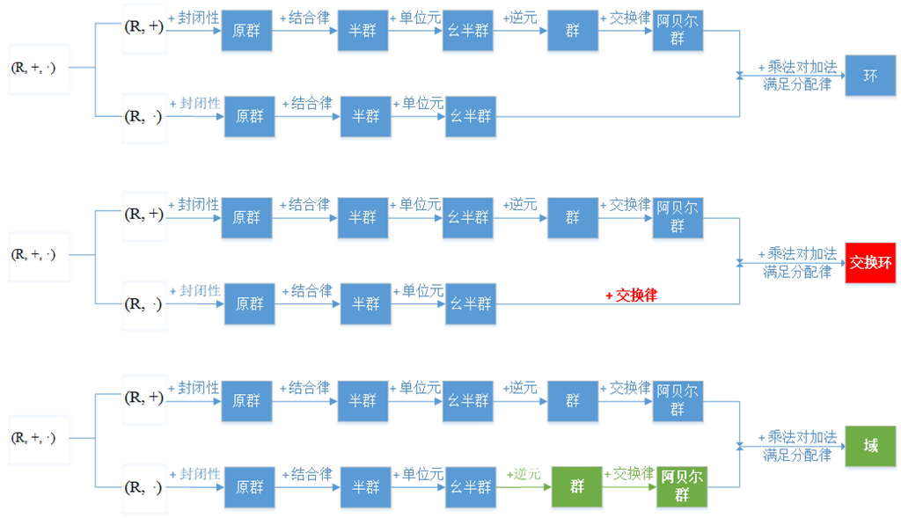
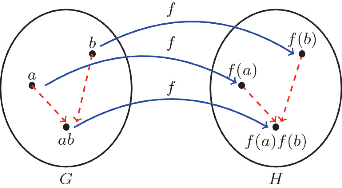

# 群论

群论是抽象代数的一个分支，主要研究一个被称为【群】的代数结构。

一个群 = 一个集合 + 一个二元运算。集合由一堆元素构成（比如 数字集合， 点集合， 符号集合）， 二元运算结合任意两个元素 a 和 b 形成了一个属于集合的元素。一个群应该满足下面4个属性:

1. closure： 封闭性，二元运算的结果还是属于集合。
2. associativity: 结合律, 举个例子： \\( (a \* b) \* c = a \* (b \* c) \\)
3. identity element: 单位元，单位元跟二元运算有关，比如加法的单位元为0，乘法的单位元为1，\\( a \* e = e \* a= a \\).
4. inverse: 逆元，\\( a \* a^{-1} = a^{-1} \* a = e \\)

如果除了上面4个条件之外，群还满足交换律，则群为**交换群**(commutative group)，又叫做**阿贝尔群**(Abelian group) .

举个例子： 椭圆曲线上面的【点集】和 【点的加法】 就构成了一个群。 两个点相加得到的点依然在椭圆曲线上，满足封闭性。\\( (P_1+P_2)+P_3 = P_1 + (P_2+P_3) \\) 满足结合律。 椭圆曲线的单位元是无穷远点，任何点和无穷远点相加，结果等于自身。椭圆曲线的逆元是一个点关于 x 轴对称的点，一个点和该点的逆元相加，结果等于无穷远点。

## 群的阶和集合元素的阶

群的阶就是集合中元素的个数。

集合元素的阶就是由元素反复进行二元运算生成的子集合的阶。如果二元运算是乘法，那么元素 a 的阶就是使得 \\( a^m=e \\) 成立的最小正整数 m 。

## 群的性质

* (消去律) \\(a \* b= a \* c \Rightarrow b=c \\)
* 方程 \\( a \* x =b  \\) 有唯一解， \\( x \in G \\)
* \\( (a \* b)^{-1}= b^{-1} \* a^{-1} \\)
* \\( (a^{-1})^{-1} = a \\)

## 判断子群

定理：H是G的非空子集，对于任意 \\( a,b \in H \\), 都有 \\( a\* b^{-1} \in H \\), 则 H 是 G 的子群。

**Proof:**

* 先证单位元: 当 a=b 时，有 \\( a \* a^{-1} = e \in H \\), 并且 \\( a\*e=e\*a=a \\),所以G的单元e属于集合H,并且e同时也是H的单位元。
* 再证逆元，我们需要证明任意一个\\( a \in H \\),它的逆元 \\( a^{-1} \in H \\), 这里使用\\( e\*a^{-1}=a^{-1} \in H \\).故而 \\( a^{-1} \\) 不仅是a在G中的逆元，同时也是a在H中的逆元。
* 证明封闭性，封闭性需要证明\\( a\*b \in H \\), 因为\\( b^{-1} \in H \\), 有 \\( a\*b=a\*(b^{-1})^{-1} \in H \\)
* 结合律：因为G是个群，它的子集的元素也必然满足结合律。

定理2: H是群G的非空子集，如果H是有限集，而且G的运算\\( \* \\)在H上满足封闭性，则H是G的子群。

## 陪集(coset)

子群H是群G都子群，H可以用来把G分解成多个元素个数相等且互不相交的子集，这些子集被称为陪集。   \
若 \\( a \in G \\), 则
\\[ aH :=\\{a\*h | h\in H\\} \\]
称为 H 关于 a 在 G 中的左陪集 (left cosets),同理，\
\\[ Ha :=\\{ h\*a | h\in H \\} \\]
称为 H 关于 a 在 G 中的右陪集(right cosets).

陪集的生成过程就是在群G中任意选一个元素a,将a与子群H的元素分别进行二元运算，得到的集合就是H关于a在G中的陪集。其中 a 叫做代表元(representative). 陪集的符号一般表示为 \\([a]_H\\).

**陪集的性质：**

* \\(a \in [a]_H\\), 代表元一定是陪集的元素，因为子集一定包含单位元，\\(e\*a=a\*e=a\\)
* \\( [e]_H=H \\), 代表元为单位元时，陪集和子集相等。
* \\( a\in H \Longleftrightarrow [a]_H=H \\), 代表元是子集的元素时，生成的陪集和子集相等。\
  证明： \\(a \in H \\),  a 和 H 的元素进行二元运算时，由于H具有封闭性，二元运算的结果一定含于H,即 \\( [a]_H \subseteq H \\); \
  另一方面：\\( \forall b \in H , a\in H \\)  \
  \\( a^{-1}\* b \in H \\), 将\\( a^{-1}\*b \\)看做一个整体，与 a 进行二元运算  \
  \\( a\*(a^{-1}\*b) \in [a]_H \Rightarrow b\in [a]_H \Rightarrow H \subseteq [a]_H  \Rightarrow [a]_H=H \\)
* \\( [a]_H =[b]_H \Leftrightarrow a^{-1}\*b \in H (或 b^{-1}\*a \in H ) \\)    \
  证明： \\( H=\\{ e, \cdots, h, \cdots \\} \\) \
    \\( [a]_H=\\{ a,\cdots,a\*h,\cdots \\} \\)  \
    \\( [b]_H=\\{b,\cdots,b\*h,\cdots\\} \\)  \
    因为H关于a的陪集等于H关于b的陪集，所以 b 必定等于 a 与 H 中某个元素进行二元运算，即 \
    \\( b=a\*h \Rightarrow a^{-1}\*b=h \\)  \
    又因为 h 是 H 中的元素 \
    所以 \\( a^{-1}\*b \in H \\)

## 拉格朗日定理(Lagrange's theorem)

定理： G 是**有限群**， H是G的任意子群，则
\\[ ord(H) | ord(G) \\]

证明：因为H的所有陪集\\( [a_1]_H,[a_2]_H,\cdots,[a_n]_H \\)其实是对G的划分，且每个陪集的元素个数相等(等于子集的阶),所以\\( |G|=k|H| \\), 其中k表示通过H生成的陪集的个数。

举个例子： 群 \\( Z_6= \\{0,1,2,3,4,5\\} \\)  \
子群 \\( 3Z_6=3\times \\{0,1,2,3,4,5\\}=\\{0,3\\} \\) \
陪集: \
$ [0]_{3Z_6}=[3]_{3Z_6}=\{0,3\} $ \
$ [1]_{3Z_6}=[4]_{3Z_6}=\{1,4\} $ \
$ [2]_{3Z_6}=[5]_{3Z_6}=\{2,5\} $

## 正规子群(normal subgroup)和商群(quotient group)

定义：设N是群G的子群，如果对于 $ \forall a\in G $,都有 $ aN=Na $,称N为G的正规子群。

给定一个正规子群N,搭配上群G的元素，就可以构造出一些陪集，这些陪集集中起来，就形成了一个集合，这个集合表示如下：
$$ G/N=\{ [a]_N | a\in G \} $$
这个集合的元素是陪集，给这个集合搭配上如下的二元运算：
$$ [a]_N *[b]_N := [a*b]_N $$
就构成了商群，$(G/N,*)$称为群G在模N下的商群。

**商群的研究范围：**
商群的元素是一堆陪集，这些陪集里面除了N(平凡陪集)以外，其他的陪集的元素都不属于正规子群，故而，商群的研究范围主要就是正规子群之外的那些元素。

**商群的阶：**
$[G:N]=\frac{|G|}{|N|}$

**商群的性质在阿贝尔群下的表现：**
阿贝尔群的子群都是正规子群(通过交互律可证)，阿贝尔群的任意子群都可以构造商群，阿贝尔群的子群构造的商群也是阿贝尔群。

**陪集和剩余类等价：**
在整数群里，陪集和剩余类本质上是一个东西，都是等价关系下的等价类。$ Z/nZ=\{[0],[1],\cdots,[n-1]\}=Z_n $

## 数学映射的定义

## 群同态(group homomorphism)

**定义:** \
设群 $(G,*)$ 和群 $(G',\Box)$, 如果函数 $ f: G \rightarrow G' $ 对于 $ \forall a,b \in G $ , 都有
$$ f(a*b)=f(a)\Box f(b) $$
则称 f 为 $ (G,*) $ 到 $(G',\Box)$ 的群同态。

**群同态的作用：** \
根据定义可知，群同态在元素映射以后，元素之间的运算规律仍然得到了保持。有的群比较容易分析，比如常见的整数模n加法群，有的群分析起来就不太方便，这时候就可以利用群同态的特效通过简单群来分析麻烦群。另外一个用途就是用于同态加密计算，只要映射函数不可逆，就可以把一个群的二元运算映射到同态群上面计算，达到加密计算的效果。

**同态像(homomorphic image):** \
G中的元素经过f映射到G'后，得到的可能只是G'的子集，也就是说，G'中的某些元素，在G中可能找不到原像。因此，就有了同态像的概念，又称为像，像指的是G'中能找到原像的那些元素构成的子集(f的同态像)。表示为$ Im\ f $

**同态核(homomorphic kernel):** \
G中的元素经过f映射后等于G'的单位元的元素构成同态核，表示为$ Ker \ f $

**阿贝尔群的m次方映射(m-power mape):** \
G是阿贝尔群

$$ G \underrightarrow f G $$
$$ a \rightarrow f(a)=a^m $$

$ f(a_b)=(a_b)^m=a^m *b^m= f(a)*f(b) $ \
$ Im\ f=G^m $  \
$ Ker\ f=G\{m\}:=\{a\in G | a^m =e\} $ \

## 群同态的性质

* $f(e)=e'$, (e和e'分别为群G和G'的单位元), 单位元映射后仍然是单位元 \
证明：$ f(e) \Box e' = f(e) = f(e*e)= f(e)\Box f(e) $
* $ f(a^{-1})=f(a)^{-1}, \forall a \in G $, 互为逆元的元素的像依然互为逆元。 \
证明：$ f(a^{-1}) \Box f(a) = f(a^{-1}*a)=f(e) $
* H是G的子群，则 f(H) 是 G'的子群，子群的像依然是子群。  \
证明：$ \forall a,b \in H, f(a), f(b) \in f(H) $, 则  \
$ f(a)\Box f(b)^{-1}= f(a)\Box f(b^{-1})= f(a*b^{-1}) \in f(H) $
* 如果像是映射群的子群，那么原像就是就是G的子群。同态核$ Ker\ f $是G的子群，同态像$Im\ f$是G'的子群。
* $ f(a^m)=f(a)^m $ \
证明： $ f(a^m)= f(a *\cdots* a)= f(a)\Box f(a) \Box\cdots\Box f(a)= f(a)^m $
* 同态核$ Ker\ f $是正规子群。\
证明：要证明同态核是正规子集，只需要证明它的左右陪集相等。\
$ \forall a \in G $, 有 $ a (Ker f)=\{a*h| h \in Ker f \} $ \
$ \exists h' \in Ker f $, 有 $ a*h=h'*a $ \
令$ a*h*a^{-1}= h' \in Ker f $, 因为 rhs 属于同态核，只需要证明 lhs 属于同态核即可，则只需要证明 lhs 经过映射后等于e'。 \
$ f(a*h*a^{-1})=f(a)\Box f(h)\Box f(a^{-1})= f(a)\Box e' \Box f(a^{-1})= f(a) \Box f(a^{-1})= e' $

## 群同构(group isomorphism)

如果一个群同态是个双射函数，那它就叫群同构。G与G'同构，记为$ G\cong G' $. 同构的群，它们本质上就是同一个群，因为它们拥有相同的性质，比如G的生成元对于的像也是G'的生成元。

**第一同构定理(first isomorphism theorem):**
第一同构定理又叫【基本同态定理】(FHT,fundamental homomorphism theorem). \

定理： 设群$ (G,*) $ 和群$ (G', \Box) $, $f: G \rightarrow G' $是群同态(同态核是 Ker f, 同态像 Im f), 则
$$ G/Ker f \cong Im f $$
同态核构造的商群 $ \{[a]_{Ker f} | a\in G\} $ 和同态像同构, 这个群同构就是把商群里面的陪集映射成代表元的像，代表元的像和具体的f相关。

## 循环群

* 任意无限循环群都只有2个生成元
* 任意循环群都是阿贝尔群  \
证明： $ \forall a,b \in <g> $, 设 $ a=g^r,b=g^k $, 则 \
$ a*b=g^r* g^k= g^{r+k}=g^{k+r}=g^k * g^r $
* 有限循环群都阶是n,则生成元g的阶也是n
* 正整数 d|n, n阶有限循环群恰有唯一的d阶子群。 \
证明：（存在性）d|n, 元素 $ g^{\frac{n}{d}} $ 阶为d,因为使得 $(g^{\frac{n}{d}})^x= e $ 成立的最小的x为d. \
则子群 $ <g^{\frac{n}{d}}> $ 的阶是d, 故而存在阶为d的子群 $ <g^{\frac{n}{d}}> $.  \
(唯一性)反证法。 假设存在另一个d阶的循环子群$ <g^k> $, 则 $ (g^k)^d =e \rightarrow n|kd \rightarrow \frac{n}{d}|k $, 也就是说 k 是 $ \frac{n}{d} $的倍数，那么 $ g^k $ 就可以由 $g^{\frac{n}{d}}$ 生成，所以 $ g^k \in <g^{\frac{n}{d}}> $, 有 $<g^k>$ 是 $ <g^{\frac{n}{d}}> $ 的子群，因为二者的阶都为d,所以两个群是同一个循环群。

举个例子： 循环群G的阶是15，15的正因子为 1，3，5，15，所以，G一共有4个子群，它们的阶分别为 1，3，5，15.

* n阶有限循环群 $ <g> , \forall k \in Z $,有 $g^k$ 的阶是 $ \frac{n}{gcd(n,k)} $  \
证明: 假设 $g^k$ 的阶为m, 则 $g^{km} = e \rightarrow n|km $, \
则 km 既是 k 的倍数，同时也是 n 的倍数， 有 $ km=lcm(k,n)=\frac{nk}{gcd(k,n)} $ \
所以 $ m=\frac{n}{gcd(k,n)} $
* 当 $ gcd(k,n)=1 $ 时，$ g^k 的阶为 \frac{n}{gcd(k,n)}=n, g^k $ 就是循环群的生成元。与 n 互素的 k 一共有 $ \phi(n) $ 个，即生成元的个数。当已知一个生成元g时，求出所有与n互素的k,那么 $ g^k $ 就是所有的生成元。
* 素数阶的群必然是(有限)循环群。    \
证明：设G是群，且 $|G|=p $, p是素数。 \
设 $a\in G, 且 a \not= e $, a的阶是k( $a^k=e $ )  \
则 $k | p $, 因为p是素数，所以k要么等于1，要么等于p，由因为 $a^k \not= e $, 所以 k=p. \
也就是说 a 的阶为p, a就是群G都生成元，所以G是（有限）循环群。 \
该定理可以归纳概括为：素数阶的群一定是**循环群**，它的生成元是**任一非单位元**。 这个定理在密码中经常用来构造循环群。\
**举个例子:** $Z_5 = \{0,1,2,3,4\}, ord(Z_5)=5 $ \
取 a=2, 则有循环子群为 $H=\{a,a^2,...,a^{n-1}, a^n=e\}$, 即 $ (2, 2^2=4, 2^3=1, 2^4=3, 2^5=0) $，这里的指数是加法模5的一种模拟表示方法。

**利用同构举一反三:**  \
同构的群本质上就是同一个群，它们的结构性质完全一样。

* 无限循环群：同构于 $Z$
* n阶有限循环群：同构于 $Z_n $

证明： 设无限循环群为 $<g>, Z $,  中任一元素为 $z$, 映射函数 $f=g^z $ . \
$\forall z,z' \in Z, f(z+z')=g^{z+z'}=g^z *g^{z'}=f(z)*f(z') $  \
所以这个映射是一个群同态，而且同态像里面的每一个 $g^z$ 都有原像 z, 所以这个映射是一个满同态。 \
根据同态核为两种情况证明单射：\

1. 如果同态核只包含单位元 0 即 $Ker f=\{0\} $, 那么 $f(0)=g^0=e $, 映射是一个单射。即是满射又是单射，所以映射是一个群同构，因为是 Z 和循环群 $<g> $同构，可见这个循环群是个无限群。这就说明，任何无限循环群都同构于Z,它们都是同一个东西，Z的所有性质都可以用于无限循环群。
2. 如果同态核除了单位元0还包含其他元素，因为Z的子群都满足格式 $nZ$, 而同态核也是Z的子群，则有 $\{0\} \subset Ker f=nZ \quad (n为正整数) $， 根据第一同构定理，可以利用群同态构造一个群同构，$Z/Ker f= Z/nZ= Z_n \cong Im f=<g> $, 又因为 $Z_n$是个有限群，所以循环群也是一个有限群，$Z_n$ 有n个元素，循环群也就有n个元素。也就是说，任何n阶有限循环群都同构于 $Z_n$.

* G是n阶有限循环群，d是n的正因子，G里的d 阶元素一共有 $\phi (d) $ 个。  \
证明： 因为 $G \cong Z_n $, 设 $a \in G $, 求G的d阶元素个数，就是求当 $ a^d=e $ 时，满足条件的a的个数。\
也就是求 $Z_n $ 中， 当 $dz=0 $ 时，满足条件的z的个数， 也就是求子群 $Z_n\{d\} := \{a \in Z_n |da=0\} $中的d阶元素的个数(也是这个循环群的生成元的个数)，又因为 $Z_n\{d\} $ 是个d阶有限循环群，所有它与 $Z_d$ 同构，所以问题就等价于求 $Z_d$ 的生成元的个数，而 $Z_d 一共有 \phi(d) $ 个生成元。

## $Z_n^* $的性质

$Z_n^* = \{a|a=0,\cdots,n-1, \quad gcd(a,n)=1\} $ 是乘法群.

**乘法阶(multiplicative order):** \
定义： $a \in Z, gcd(a,n)=1 $, 设k是满足
$$ a^k \equiv 1 \pmod{n} $$
的最小正整数，称k是a在模n下的乘法阶，记为 $ord_n(a)$, 其实这里的k同时也是元素a的阶。

**原根(primitive root):** \
定义： $g \in Z, gcd(g,n)=1 $, 如果 $ord_n(g)=\phi(n) $， 则称g是模n下的原根。\
则 $g^{ord_n(g)} \equiv g^{\phi(n)} \equiv 1 \pmod{n} $

**原根存在的条件:** \
设 p 是奇素数，e是正整数 \
$n=1,2,4,p^e,2p^e $ 时，模n下存在原根。\
RSA中 $n=p\times q $,p,q是不相等的素数，所以RSA的模数下就不存在原根。

**存在原根的 $Z_n^*$ 是循环群：**
如果模n下存在原根，原根的阶是 $\phi(n)$， 而 $Z_n^*$ 的阶也是 $\phi(n)$, 所以原根g就是 $Z_n^*$ 的生成元，此时，$Z_n^*$ 就是循环群。 明显 $Z_p^*$ 就是一个循环群。

## 如何找原根(生成元)

根据拉格朗日定理，子群的阶整除原群的阶。 则有 $\forall a\in Z_n^*, ord_n(a) | \phi(n) $   \
a是原根 $\rightarrow ord_n(a)=\phi(n) $ \
对 $\phi(n) $做素因子分解有：$\phi(n)= p_1^{e_1} \cdots p_r^{e_r} $   \
当a不是原根时，假设a的阶为 $ord_n(a)=d $, 根据拉格朗日定理有 $d|\phi(n), d<\phi(n) $, \
$$d|\phi(n) \Rightarrow \exists p_j, d|\frac{\phi(n)}{p_j} \Rightarrow \exists q, dq=\frac{\phi(n)}{p_j} $$
上面的推导时因为 d 是 $\phi(n)$ 的因子，且 $d<\phi(n)$，那d就一定等于 $\phi(n)$ 的唯一质数分解式子中的某些素数的某些指数次的组合。\
因为a的阶为d,则有 $ a^d \equiv 1 \pmod{n} \Rightarrow a^{\frac{\phi(n)}{p_j}} \equiv (a^d)^q \equiv 1 \pmod{n} $ \
所以 $a是原根 \Leftrightarrow a^{\frac{\phi(n)}{p_i}} \not\equiv 1 \pmod{n}, i=(1,\cdots,r) $

故而，找 $Z_n^*$原根的算法如下：

1. 唯一质数分解 $\phi(n)= p_1^{e_1}p_2^{e_2}\cdots p_r^{e_r} $
2. 任意选择一个 $a \in Z_n^* $, 即任意选择一个与n互质的数
3. if $a^{\frac{\phi(n)}{p_i}} \not\equiv 1 \pmod{n}, i=(1,2,\cdots,r) $ \
    $ \quad output \quad a $  \
    else goto  2

**举个例子：**\
求 $Z_{19}^*$ 的所有生成元。 \
$\phi(19)=19-1=18=2\times 3^2 $   \
$ p_1=2, p_2=3 $  \
$ \frac{\phi(n)}{p_i}= \{ \frac{18}{2}=9, \frac{18}{3}=6 \} $ \
任意选择与19互质的数2, 计算 $a^{\frac{\phi(n)}{p_i}}=\{2^9 \not\equiv 1 \pmod{19}, 2^6 \not\equiv 1 \pmod{19} \} $  \
所以 2 是 $Z_{19}^*$ 的一个生成元。

由于在循环群 $Z_n$ 中, 群的阶为n，如果已知一个生成元为g, 当 gcd(k,n)=1 时，$g^k$的阶为 $\frac{n}{gcd(n,k)}=n $, 则 g^k 也是群 $Z_n$的生成元, $Z_n^*$ 与 $Z_n$ 同构，直接套用 $Z_n $的性质来求解所有的生成元。

 $Z_{19}^*$的阶为$\phi(19)=19-1=18$， 与18互质的数有 $ k=\{1,5,7,11,13,17\} $, 则 \
$
2^1 \equiv 2 \pmod{19}, \\
2^5 \equiv 13 \pmod{19},  \\
2^7 \equiv 14 \pmod{19},  \\
2^{11} \equiv 15 \pmod{19}  \\
2^{13} \equiv 3 \pmod{19}  \\
2^{17} \equiv 10 \pmod{19}  \\
$
也就是说 $\{2,3,10,13,14,15\} $ 都是 $Z_{19}^*$ 的生成元。\
验证一下：\
$
3^9 \equiv 18 \pmod{19}, 3^6 \equiv 7 \pmod{19} \\
10^9 \equiv 18 \pmod{19}, 10^6 \equiv 11 \pmod{19} \\
13^9 \equiv 18 \pmod{19}, 13^6 \equiv 11 \pmod{19} \\
14^9 \equiv 18 \pmod{19}, 14^6 \equiv 7 \pmod{19} \\
15^9 \equiv 18 \pmod{19}, 15^6 \equiv 11 \pmod{19} \\
$

## 离散对数的性质

* $a \equiv g^r \pmod{n} \Leftrightarrow log_g(a) \equiv r \pmod{\phi(n)} $   \
证明： 令 $x=log_g(a) $, 则 $a\equiv g^x \pmod{n} $ \
$\Leftrightarrow g^x \equiv g^r \pmod{n}$   \
在循环群中生成元生成的元素相等，说明x和r之间的距离正好差了一个循环(生成元的阶 $\phi(n)$)，也就是说x,r在循环下同余 \
$\Leftrightarrow x \equiv r \pmod{\phi(n)}$   \
$\Leftrightarrow log_g(a) \equiv r \pmod{\phi(n)}$   \
* 根据上面的性质可以联想到 $g^r \pmod{n} = g^{r \bmod \phi(n)} \pmod{n} $, 因为生成元进行指数次运算，这些指数如果在生成元的阶下同余的话，得到的结果是相等的。

设 gcd(b,n)=1, $y=log_g(b) $， m是正整数，h也是原根:

* $log_g(ab) \equiv log_g(a)+log_g(b) \pmod{\phi(n)} $  \
证明: \
$
ab \equiv g^x g^y \equiv g^{x+y} \pmod{n} \\
\Rightarrow log_g(ab) \equiv x+y \pmod{\phi(n)} \\
\Rightarrow log_g(ab) \equiv log_g(a)+log_g(b) \pmod{\phi(n)} \\
$
* $log_g(a^m) \equiv m \times log_g(a) \pmod{\phi(n)} $   \
proof: \
$
a^m \equiv g^{xm} \pmod{n}  \\
\Rightarrow log_g(a^m) \equiv mx \pmod{\phi(n)}  \\
\Rightarrow log_g(a^m) \equiv m \times log_g(a) \pmod{\phi(n)}  \\
$
* $log_h(a) \equiv log_h(g) \times log_g(a) \pmod{\phi(n)} $  \
proof: \
设 $g\equiv h^t \pmod{n}, t=log_h(g), 0 \leq t \leq \phi(n) $ \
$
a \equiv g^x \pmod{n} \\
\Rightarrow a\equiv h^{tx} \pmod{n} \\
\Rightarrow log_h(a) \equiv tx \pmod{\phi(n)}  \\
\Rightarrow log_h(a) \equiv log_h(g) \times log_g(a) \pmod{\phi(n)}  \\
$

## Carmichael funtion 推导的结论

Carmichael function 表示为 $\lambda(n)$, n的唯一质因子分解为 $n=p_1^{e_1}p_2^{e_2}\cdots p_r^{e_r} $  \
则 $\lambda(n)=lcm[\lambda(p_1^{e_1}), \lambda(p_2^{e_2}),\cdots,\lambda(p_r^{e_r})] $.

**Carmichael funtion在 $Z_n^*$ 的结论：** \
$Z_n^*$ 的阶是 $\phi(n)$, $Z_n^*$的元素的最大阶为 $\lambda(n)$.

## 置换

一个有限集合 S 到自身的双射称为 S 的一个置换，集合 \\( S={a_1,a_2,\cdots,a_n} \\)上的置换可以表示为
\\[ f=\begin{pmatrix}
  a_1,a_2,\cdots,a_n \\\\
  a_{p_1},a{p_2},\cdots,a{p_n}
\end{pmatrix}
 \\]
意为将 \\( a_i \\)映射为 \\( a_{p_i} \\), 其中 \\( p_1,p_2,\cdots,p_n \\) 是 \\( 1,2,\cdots,n \\)的一个排列。显然 S 上的所有置换的数量为 n!。

所以置换的本质就是一个双射函数。

## 对称群 (symmetric group) 和 置换群 (permutation group)

给定一个集合 M, 集合M的所有**可逆置换**构成集合 N, N 关于可逆置换的复合（函数的复合也可以看作是两个函数间的二元运算）满足封闭性，结合律，有单位元 (恒等置换，即每个元素映射到它自己)，有逆元 (交换置换表示中的上下两行)，因此构成一个群，称为 M 的对称群，记为\\( Sym(M) \\).

\\( Sym(M) \\)的任一子群称为 M 的置换群。

如果 M 是包含 n 个元素的有限集， 称其到自身的可逆映射为 **n阶置换** (permutation)， 其对称群称为 **n阶对称群**(sysmmetric group of degree n).

举个例子： 假设我们有集合 M={1,2,3}, 所有的置换就是对集合M做全排列，结果如下： \
\\(
  \begin{pmatrix}
    1,2,3 \\\\
    1,2,3
  \end{pmatrix}
  \begin{pmatrix}
    1,2,3 \\\\
    2,1,3
  \end{pmatrix}
  \begin{pmatrix}
    1,2,3 \\\\
    3,1,2
  \end{pmatrix}
  \begin{pmatrix}
    1,2,3 \\\\
    1,3,2
  \end{pmatrix}
  \begin{pmatrix}
    1,2,3 \\\\
    2,3,1
  \end{pmatrix}
  \begin{pmatrix}
    1,2,3 \\\\
    3,2,1
  \end{pmatrix}
\\)

以上这六个置换就是就是对称群的元素集合，集合的运算就是对映射函数进行复合操作，单位元就是第一个元素（恒等置换），逆元就是把每一个置换表达中的上下两行交换得到的新的映射函数，而且每次进行复合操作得到的映射函数都是上面的置换之一，且复合函数满足结合律。

## References

* [代数结构入门：群、环、域、向量空间](http://sparkandshine.net/algebraic-structure-primer-group-ring-field-vector-space/)
* [wiki: Permutation](https://en.wikipedia.org/wiki/Permutation)
* [wiki: Permutation group](https://en.wikipedia.org/wiki/Permutation_group)
* [wiki: Symmetric group](https://en.wikipedia.org/wiki/Symmetric_group)
* [wiki: Bijection, injection and surjection](https://en.wikipedia.org/wiki/Bijection,_injection_and_surjection)
* [知乎:排列与对称群](https://zhuanlan.zhihu.com/p/402197369)
* [wiki: 对称群](https://zh.wikipedia.org/wiki/%E5%AF%B9%E7%A7%B0%E7%BE%A4_(n%E6%AC%A1%E5%AF%B9%E7%A7%B0%E7%BE%A4))
* [wiki:置换群](https://zh.wikipedia.org/wiki/%E7%BD%AE%E6%8D%A2%E7%BE%A4)
* [oi-wiki: 群论](https://oi-wiki.org/math/group-theory/)
* [fandom-wiki: 对称群](https://math.fandom.com/zh/wiki/%E5%B0%8D%E7%A8%B1%E7%BE%A4?variant=zh-sg)
* [bilibili: 复合函数结合律的证明](https://www.bilibili.com/video/BV1zZ4y1p793/)
* [permutation-generator](https://www.dcode.fr/permutations-generator)
* [bilibili: Alice-Bob 群论](https://www.bilibili.com/video/BV1qs4y1s7kv/?p=2&spm_id_from=pageDriver&vd_source=950e7977d383cac0e43e8756252ddf3f)
