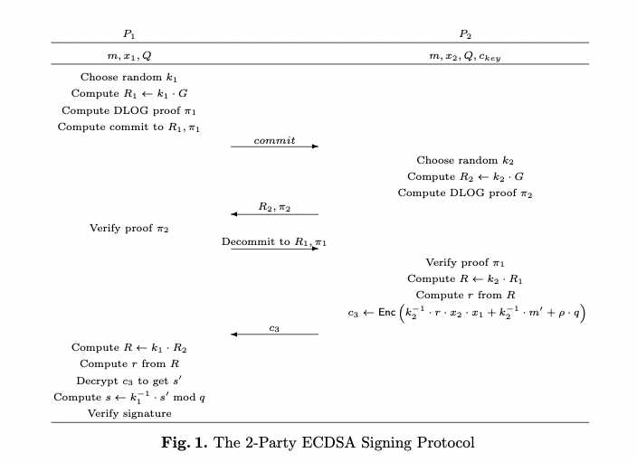

# Pratical MPC

## It is hard to construct threshold signing for ECDSA

In ECDSA: \
 \\( s= k^{-1}(h+d_Ar) \bmod q \\).  \
If we shares k1,k2, such that:   \
  \\(k_1 + k_2=k \bmod q \\)  \
it is very difficult to compute \\( k_1',k_2' \\), such that  \
 \\( k_1'+k_2'=k^{-1} \bmod q \\)

## Two-party protocol in <a href="#r4">[4]</a>

[4]use multiplicative sharing of x and k. That is the parties hold \\(x_1,x_2\\) such that \\( x_1\cdot x_2=x \bmod q \\),and in each signing operation they generate \\(k_1,k_2\\) such that \\( k_1 \cdot k_2=k \bmod q \\). For example: \
\\(P_1: c_1=Enc(k_1^{-1},H(m)), c2=Enc(k_1^{-1} \cdot x_1 \cdot r )\\) \
Then , using scalar multiplication(denoted \\(\odot\\)) and homomorphic addition(denoted \\(\oplus\\))  \
\\( P_2: (k_2^{-1} \odot c_1)\oplus [(k_2^{-1} \cdot x_2)\odot c_2] \\) \
which will be an encryption of  \
\\( k_2^{-1} \cdot (k_1^{-1}\cdot H(m)) + k_2^{-1}\cdot x_2\cdot(k_1^{-1} \cdot x_1 \cdot r)= k^{-1} \cdot (H(m)+ r\cdot x) \\)

## Two-party protocol in <a href="r2">[2]</a>

* P2 hold \\( Enc(x_1), x2, \\)
* P1 and P2 generate \\( R=k_1 \cdot k_2 \cdot G \\) by Diffle-Hellman key exchange with zkp
* P2 compute the encryption version of: \\( k_2^{-1}\cdot H(m)+k_2^{-1}\cdot r \cdot x_1 \cdot x_2 \\)
* P1 decrypt and multiplies the result by \\( k_1^{-1} \\)

## Rotate share

In the implemention of unbound_security, when refresh share, they actually refresh the paillier's **ek**(encode key pair), **dk**(decode key pair).

Because Party_2 hold the encrypted x_1, if the paillier's dk is leaked, Party_2 can construct the private key.

In the above eqution, it seems that we can refresh \\( x_1, x_2 \\) at the same time, because \\( x_1 \times r \times x_2 \times r^{-1} = x_1 \times x_2 \\).

## todo

* carrying out private-key operations via a secure protoco that reveals nothing but the output.
* revoke a party`s share.
* Is it possible to construct a full-threshold protocol for multiparty ECDSA, with practicaldistributed key generation and signing?
* It is possible for P1 to singlehandedly cmpute r from \\( R=(r_x,r_y) \\)
* Generate generic secret,then use to derivate bip. Is this safe?

## References

1. [https://docs.particle.network/security](https://docs.particle.network/security)
2. <a id="r2" href="https://eprint.iacr.org/2018/987.pdf">Fast Secure Multiparty ECDSA with Practical Distributed Key Generation and Applications to Cryptocurrency Custody</a>
3. [Fast Secure Two-Party ECDSA Signing](https://eprint.iacr.org/2017/552.pdf)
4. <a id="r4" href="https://eprint.iacr.org/2016/013.pdf">Threshold-optimal DSA/ECDSA signatures and an application to Bitcoin wallet security</a>
5. [unbound security github](https://github.com/unboundsecurity/blockchain-crypto-mpc)
6. [unbound security white paper](https://github.com/unboundsecurity/blockchain-crypto-mpc/blob/master/docs/Unbound_Cryptocurrency_Wallet_Library_White_Paper.md)
7. [Commitment schema wiki](https://en.wikipedia.org/wiki/Commitment_scheme)
8. [The Simplest Protocaol for Oblivious Transfer](https://eprint.iacr.org/2015/267.pdf)
