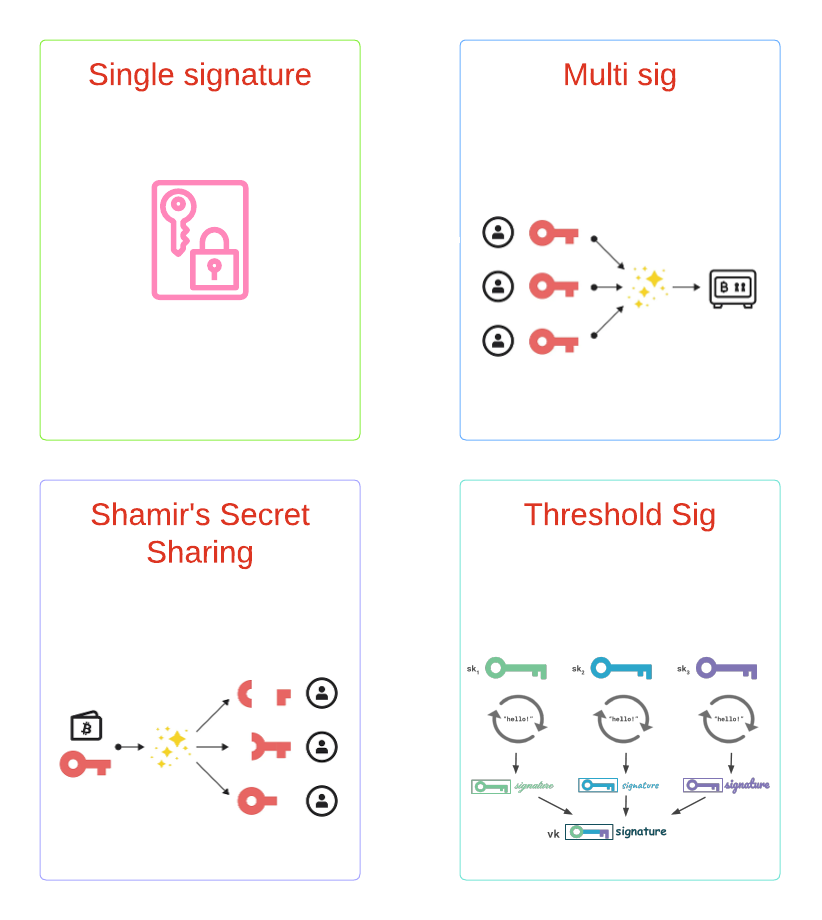

# TSS

Threshold Signatures

## TSS vs Multisig vs SSS(Shamir's Secret Sharing)

### TSS vs Multisig

TSS与Multisig的主要区别在于TSS在链下计算签名，Multisig通过合约在链上完成多个签名的验证。和多签相比，TSS主要有以下优点：

* 便捷性，Multisig每支持一个链，就需要部署一次合约，TSS只要椭圆曲线和签名算法不变，就不需要做额外的操作。比如所有EVM兼容的链，只需要实现一个ECDSA over Secp256k1的TSS库就可以全支持了。
* 省gas, TSS花费的gas和EOA账户完全一致，Multisig根据实现不同，花费的gas也不同，但无论哪种实现，都比TSS花的gas多。

### TSS vs SSS

TSS与SSS的主要区别在于在整个生命周期中是否出现了**私钥**。SSS的方案中存在一个叫做dealer的角色，dealer在keygen和sign阶段都会拥有完整的私钥。如果dealer服务器出现故障，就会导致单点失败；如果dealer是一个恶意参与方，就会导致rug pull。TSS的方案中，要求在整个生命周期中都不能出现**私钥**，各个参与方都是平等的，安全性更高。

## TSS 生态介绍

当前业界的TSS方案可以分为两类，{2-2}和{t-n}。\
目前{2-2}的实现方案主要依据[Lindell 17](https://eprint.iacr.org/2017/552.pdf)这篇paper, {t-n}的实现方案则主要依据 [GG18]( https://eprint.iacr.org/2019/114.pdf), [GG20](https://eprint.iacr.org/2020/540.pdf)这两篇paper。

* **{2-2}:** Zengo Wallet, Particle Network, Coinbase WaaS, Unipass
* **{t-n}:** tss-lib(Binance: GG18), tss-lib(SwingBy protocol: GG20), Safeheron(GG18,GG20,CMP)

可以看到，做C端钱包的大都选择了{2-2}模式，而{t-n}模式一般都用于B端解决方案中。主要是因为在C端钱包在实践过程中，无法为{t-n}方案找到**可信第三方**。就以{2-3}为例，除了服务提供方和用户自身外，还需要一个可信第三方，如果这个第三方由服务提供方来扮演，那服务提供方就可以完全掌握用户资产；如果用户自己同时使用两个设备来作为参与方，又会给普通用户带来糟糕的用户体验。所以，在C端钱包场景下，业界普通选择了{2-2}模式。

另外，和传统的助记词钱包相比，C端钱包选择TSS,主要看中以下两个优点：

* 安全，整个生命周期中都不会出现私钥，而且share可以更新
* 丝滑，利用TSS可以屏蔽掉私钥，助记词等概念，帮助Web2用户轻松过渡到Web3

## 简单讲解 TSS 的数学原理

### Lindell-17 数学原理

在ECDSA里面，签名
$$s= k^{-1}(h+xr)= k^{-1}h+ k^{-1}xr $$
使用乘法来分享 x 和 k。 即 $x_1 \times x_2=x \pmod{q}$, 在每次签名的时候，双方分别生成$k_1,k_2$,令 $k_1 \times k_2=k \pmod{q} $, 则计算签名的过程如下：

* P1 and P2 generate $R=k_1\cdot k_2 \cdot G$ by Diffle-Hellman key exchange with zkp
* P1: $c_1=Enc(k_1^{-1}\cdot h), c_2=Enc(k_1^{-1}\cdot x_1 \cdot r) $
* P2: $Enc(s)= (k_2^{-1} \odot c_1)\oplus [(k_2^{-1} \cdot x_2) \odot c_2] $
* P1: $Dec(Enc(s))= k_2^{-1}(k_1^{-1} \cdot h) + k_2^{-1}\cdot x_2 \cdot (k_1^{-1} \cdot x_1 \cdot r)= k^{-1} \cdot (h+xr) $

Lindell-17在上面的流程中做了一个优化，上面的流程可以总结为P1计算了部分签名，加密后发送给P2,P2利用同态加密在P1的部分签名的基础上进行计算，得到完整的加密版本的签名，然后把加密版本的签名发送给P1,P1通过解密得到签名的明文。Lindell-17的优化思路是，如果把P1的share加密后分享给P2,让P2独立完成签名的计算，然后把加密版本的签名发送给P1,P1通过解密得到签名的明文，这样就可以减少一次通信。过程如下：

* P1 and P2 generate $R=k_1\cdot k_2 \cdot G$ by Diffle-Hellman key exchange with zkp
* P2: $Enc(s')= k_2^{-1}\cdot h + k_2^{-1} \cdot r \cdot x_1 \cdot x_2 $
* P1: $Dec(Enc(s'))= s', s=s' \cdot k_1^{-1} $

### GG20数学原理

[https://gimmi7.github.io/stromata/zk/gg20.html](https://gimmi7.github.io/stromata/zk/gg20.html)

## 对比介绍TSS开源库

* [blockchain-crypto-mpc](https://github.com/unboundsecurity/blockchain-crypto-mpc): {2-2},C, Lindell 写完paper，找了unboundsecurity 帮忙实现。Lindell去Coinbase做密码学主管，unboundsecurity也被Coinbase收购，不再维护。
* [Zengo](https://github.com/ZenGo-X): {2-2},{t-n},rust, Zengo在TSS领域做了大量的research,同时贡献了大量的开源库，大部分 TSS 相关的 paper 实现都可以在Zengo 的github 上找到。
* [tss-lib](https://github.com/bnb-chain/tss-lib): {t-n},go, Binance实现的GG18。
* [multi-party-ecdsa-cpp](https://github.com/Safeheron/multi-party-ecdsa-cpp): {t-n},C++, Safeheron 实现了GG18，GG20, CMP

这些开源实现都是不包含通信协议的，没有办法开箱即用

* [twoparty-mpc](https://github.com/Gimmi7/twoparty-mpc), {2-2},rust,websocket, 利用Lindell-17实现了ECDSA,Schnorr聚合签名实现了EDDSA。
* [MPCCrypto](https://github.com/Gimmi7/MPCCrypto), {2-2},java,websocket, 通过jni 调用unboundsecurity blocckchain-crypto-mpc, 添加了websocket作为通信协议。

## References

* [Shamir 门限秘密共享方案](https://blog.sagiri.tech/index.php/archives/55/)
* [Zengo: Threshold Signatures Explained](https://academy.binance.com/en/articles/threshold-signatures-explained)
* [Unipass: Master Key](https://docs.wallet.unipass.id/architecture/master-key)
* [Particle Network: Security](https://docs.particle.network/overview/security)
* [CoinBase: Digital Asset Management with MPC (Whitepaper)](https://www.coinbase.com/blog/digital-asset-management-with-mpc-whitepaper)
* [Zengo: awesome-tss](https://github.com/ZenGo-X/awesome-tss)
* [zeeve: What is the Threshold signature scheme(TSS)? Multi-party Computation(MPC) simplified](https://www.zeeve.io/blog/what-is-the-threshold-signature-schemetss-multi-party-computationmpc-simplified/)
* [Bitcoin: Multisig vs. Shamir’s Secret Sharing Scheme](https://medium.com/clavestone/bitcoin-multisig-vs-shamirs-secret-sharing-scheme-ea83a888f033)
