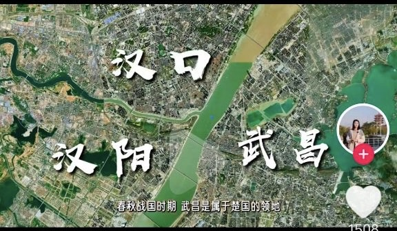

# 武汉攻略

武汉由3个镇组成，分别是武昌，汉口，汉阳。

## 出发

* 最优选项为 13:05-17:07 北京西-汉口，只有一班
* 备选为耗时4小时以内的 北京西-武汉

## 返程

* 武汉-北京西  比较合适， 可选时间段多

---

## 武昌区

### 大成路🍔（武昌区，位于长江东岸， 武汉长江大桥以南）

* 武汉本地人的过早地方，不排队
* 小秋水饺，门口有（炸面窝，鸡冠饺）
* 丽华早点：各种炸物
* 矮子馅饼： 适合带走送朋友

### 粮道街🍔 （武昌区，位于长江东岸，武汉长江大桥以北）

* 家阳赵师傅油饼包烧卖，点咖啡套餐可以免排队
* 多肉花卷
* 严老幺，三鲜豆皮，烧卖，黑芝麻酱热干面，需要排1个小时
* 赵师傅红油热干面，推荐的人很多

### 东湖 （武昌区）

* 东湖樱花园
* 东湖之眼，粉色摩天轮，转一圈13分14秒
* 东湖绿道，散步遛弯
* 氢气球，拍照
* 凌波门，看日出日落，人很多，也很卷

### 湖北省博物馆  （武昌区，离东湖绿道近）

感受荆楚历史，看越王勾践剑

### 黄鹤楼（武昌区）

* 晚上开灯拍照：坐无人驾驶的5号线，司门口黄鹤楼站，A出口看近景，C出口看远景
* 白天登楼: 感觉很boring

---

## 汉口镇

### 山海关🍔 （江岸区，属于汉口版块，位于长江西岸， 7号线以北）

* 汪记鲜鱼糊汤粉
* 徐氏糯米包油条
* 毛氏汽水包
* 李记鸡冠饺
* 双黄牛肉面馆
* 燕子煨汤，排骨藕汤
* 金三角吊子煨汤，排骨藕汤

### 古德寺 （江岸区）

缅印异域建筑风格的寺庙，是一座佛教寺庙。

### 黎黄陂路 （江岸区）

旧俄租界，有各种复古的建筑，适合喝下午茶。

### 兰陵路🍜 （江岸区，武汉市名族中学东北门附近）

* 王记生烫牛杂面
* 刘记三狗牛肉面馆
* 严师傅重油烧麦

### 老通城豆皮 (江岸区)

携程口碑榜排名第一的豆皮店

### 武汉美术馆 (江岸区)

和一个粉丝气球贴画拍照的地方

### 江汉路步行街🍱🍦 （江汉区）

* 武汉老租界，吃喝玩乐一条龙
* 水塔美食街，happy站台
* 汉口江滩，沙滩，游船

### 江汉区湖北菜🍚

* 湖锦
* 亢龙太子酒轩
* 三五醇酒店
* 小民大排档

### 万松园🍚🍤 （江汉区）

* 靓靓蒸虾
* 夏氏砂锅，混合菜系，砂锅为主
* 金焱牛肉粉
* 阿宝生煎
* 肥肥虾庄
* 24小时营业的余艳梅拌面馆，这家是个单单，离万松园还有2公里， 不过推荐他们家的很多

---

## 看樱花

樱花开放时间在三月初到三月底，武大樱园、樱花大道、樱顶等地都很适合观赏。只是不同樱花花种有不同的花期。
武汉大学和东湖樱园东盛花期都在3月中旬。

* [武汉本地宝赏樱攻略](http://m.wh.bendibao.com/tour/66134.shtm)

## Others

* 鹦鹉洲长江大桥
* 江汉关博物馆
* 财大小吃街(江夏区，略偏)： 阿宝生煎，藕粉，蛋肉煲，梅花糕，黄石土豆片

## References

* [武汉三镇](https://www.douyin.com/video/7050024854648605965)
* [抖音图文攻略](https://www.douyin.com/note/7218140222100393248)
* [武汉本地宝赏樱攻略](http://m.wh.bendibao.com/tour/66134.shtm)
* [武汉本地人攻略](https://www.douyin.com/video/7198111400781204771)
* [武汉两天攻略](https://www.douyin.com/video/7209643217103473981)
* [武汉4天3夜攻略](https://www.douyin.com/video/7217736467811028263)
