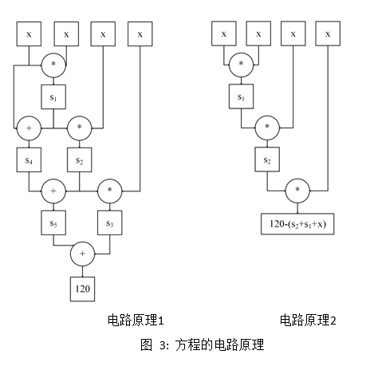

# Groth16: zkSNARKs

zero knowledge succinct non-interactive arguments of knowledge.

## bilinear groups

bilinear groups $(p, \mathbb{G_1}, \mathbb{G_2}, \mathbb{G_T}, e,g,h)$ with the folloing properties: \

- $\mathbb{G_1}, \mathbb{G_2}, \mathbb{G_T} $ are groups of prime order p
- The pairing e: $\mathbb{G_1} \times \mathbb{G_2} \rightarrow \mathbb{G_T} $ is a bilinear map
- g is a generator for $\mathbb{G_1}$, h is a generator for $\mathbb{G_2} $, and $e(g,h)$ is a generator for $\mathbb{G_T} $
- There are efficient algorithms for computing group operations, evaluating the bilinear map, deciding memberships of the ghe groups, deciding equality of group elements and sampling generators of the groups. We refer to these as generic group operations.

**linear map**: In the context of groups, a linear map is indeed a homomorphism. After the map funtion, the operations of group preserved.

**bilinear map**: $e: \mathbb{G_1} \times \mathbb{G_2} \rightarrow \mathbb{G_T} $ if a bilinear map, when we hold the first entry of the bilinear map fixed while letting the second entry vary, the result is a linear operator, and similarily for when we hold the second entry fixed.

Groth's constant size NIZK argument is based on constructing a set of polynomial equations and using pairings to efficiently verify these equations.

## bilinear group types

$e: \mathbb{G_1} \times \mathbb{G_2} \rightarrow \mathbb{G_T} $, there are many ways to set up bilinear groups both as symmetric bilinear groups where $\mathbb{G_1} =\mathbb{G_2} $ and asymmetric bilinear groups where $\mathbb{G_1} \not= \mathbb{G_2} $.

- Type 1: $\mathbb{G_1} = \mathbb{G_2} $
- Type 2: thers is an efficiently computable non-trivial homomorphism $\Psi: \mathbb{G_2} \rightarrow \mathbb{G_1} $
- Type 3: no such efficiently computable homomorphism exists in either direction between $\mathbb{G_1} $ and $\mathbb{G_2} $

Asymmetric bilinear groups have higher efficiency than symmetric bilinear groups. \
Type 3 bilinear groups are the most efficient type of bilinear groups and hence most relevant for practical applications.

## pairing product

## field

[BCI+13] propose a  transformation in the symmetric bilinear group setting, where each field element gets compiled into two group elements.

## R1CS

Rank 1 Constraint System, 阶为1的约束系统。约束系统通过等式来表达约束关系, 比如 a+b=5,就约束了a,b的和为5.

what's the meaning of rank in R1CS:\
 In the context of "Rank-1 Constraint System", the term "rank" refers to the number of independent equations in the constraint system. Independent equations refer to a set of equations within the system that are not linearly dependent on each other.

约束系统的阶等于**线性依赖等式集**的个数，R1CS就是只有一个线性依赖等式集的约束系统。

## 多项式时间算法问题转换为R1CS

任意多项式时间算法问题都可以转换成某些阶为1的等式。也就是说任何P问题都可以转换成 R1CS。

下面以解方程为例子，因为解方程是P问题，根据P问题构造NP问题。

### 方程等价于R1CS

方程 $x^4+x^3+x^2+x=120 $ 可以拆分为如下阶为1的线性依赖等式集：\
$s_1 = x *x $ \
$s_2 = s_1* x $ \
$s_3 = s_2* x $ \
$s_4 = s_1 + x $ \
$s_5 = s_4 + s2 $ \
$120 = s_5 + s3 $ \

关键结论： x=3满足方程的解，等价于x=3满足电路约束。\
关键结论：x满足任意多项式时间运算 y=f(x),等价于x满足电路约束。

这6个等式限定了方程的运算规则，能够用电路约束表达同样的运算规则。电路约束即能用硬件或FPGA实现，也能用软件实现等价的功能。\
阶为1的等式 = 电路约束 \
阶为1的乘法等式 = 乘法约束 \
阶为1的加法等式 = 加法约束

上述6个等式组成1阶线性等式集包含3个乘法等式和3个加法等式，可以使用3个乘法约束和3个加法约束实现运算原理。此外，可以将加法约束优化到乘法约束中，则上述6个等式可以简化为3个等式，仅使用3个乘法约束即可实现等价的运算规则。

$s_1 = x *x $ \
$s_2 = s1* x $ \
$120 - (s_2+s_1+x)= s_2*x $\


<div style="color:green">
<p>方程分解满足方程 </p>
<p>$\downarrow$  </p>
<p>方程的解满足R1CS </p>
</div>

### 方程的解等价于向量

上面的例子中方程的解 x=3 等价于 $\vec{s}=[1,out,x,s_1,s_2] $, 根据上面的等死可以逐步计算出 $s1,s2,out,1$,从而能够构造向量 $\vec{s} $; 反之，向量 $\vec{s} $包含x,因此已知向量 $\vec{s} $,可以得到 x=3. 因此，方程的解 x=3 和向量 $\vec{s} $ 是等价的。其中，向量 $\vec{s} $中的1能够表达任意常量。如果算法中有任意常量，则任意常量都是1的倍数。该倍数存储到后续的多维向量中，能够表达任意常量。out是方程的计算结果 120.

R1CS的约束等式中的中间状态变量约多，则等价的向量维度约高，在后续的计算中运算量会更大，所以需要优化掉中间状态变量。

方程的解x=3就是零知识证明中的witness，在实际应用中，为防止verifier欺骗prover,不能将所有数据隐藏起来，需要公开局部参数，所以 1，out 需要公开， $x,s_1,s_2 $ 隐藏。因此将向量 $\vec{s} $ 拆分为公开数据和隐私数据，公开数据记为 statement=(1,out), 隐私数据记为 witness=$(x,s_1,s_2)$。这里的out是计算结果120，对于Layer2技术，out则是Merkle根。

```text
因此，得出zk-SNARK协议的核心构造：
数据分为公开数据 statement 和私密数据 witness,
则构造向量为 (statement;witness)
```

witness 满足 R1CS约束转换成向量内积

对于等式 $s_1= x *x $ 可以转换成如下的向量内积
$$
\begin{Bmatrix}
\vec{s} \cdot [0,0,0,1,0]=[1,out,x,s_1,s_2] \cdot [0,0,0,1,0]= s_1 \\
\vec{s} \cdot [0,0,1,0,0]=[1,out,x,s_1,s_2] \cdot [0,0,1,0,0]= x \\
\vec{s} \cdot [0,0,1,0,0]=[1,out,x,s_1,s_2] \cdot [0,0,1,0,0]= x \\
\end{Bmatrix}
$$
令 $w_1=[0,0,0,1,0], u_1=[0,0,1,0,0], v_1=[0,0,1,0,0]$, 因此，有以下等价关系：
$$
s_1= x* x \\
\Updownarrow \\
\vec{s} \cdot w_1 = \vec{s} \cdot u_1 * \vec{s} \cdot v_1
$$

同理对于等式 $s_2=s_1 *x $, 可以转换成如下向量内积：
$$
\begin{Bmatrix}
\vec{s} \cdot [0,0,0,0,1]=[1,out,x,s_1,s_2] \cdot [0,0,0,0,1] = s_2 \\
\vec{s} \cdot [0,0,0,1,0]=[1,out,x,s_1,s_2] \cdot [0,0,0,1,0]= s_1 \\
\vec{s} \cdot [0,0,1,0,0]=[1,out,x,s_1,s_2] \cdot [0,0,1,0,0]= x \\
\end{Bmatrix}
$$
令 $w_2=[0,0,0,0,1], u_2=[0,0,0,1,0], v_2=[0,0,1,0,0] $, 因此，有以下等价关系：
$$
s_2=s_1* x \\
\Updownarrow \\
\vec{s} \cdot w_2 = \vec{s} \cdot u_2 * \vec{s} \cdot v_2
$$

同理对于等式 $120-(s_2+s_1+x)=s_2 *x$, 可以转换成如下向量内积：
$$
\begin{Bmatrix}
\vec{s} \cdot [0,1,-1,-1,-1]=[1,out,x,s_1,s_2] \cdot [0,1,-1,-1,-1] = 120-(s_2+s_1+x) \\
\vec{s} \cdot [0,0,0,0,1]=[1,out,x,s_1,s_2] \cdot [0,0,0,0,1] = s_2 \\
\vec{s} \cdot [0,0,1,0,0]=[1,out,x,s_1,s_2] \cdot [0,0,1,0,0]= x \\
\end{Bmatrix}
$$
令 $w_3=[0,1,-1,-1,-1], u_3=[0,0,0,0,1], v_3=[0,0,1,0,0] $,因此，有以下等价关系：
$$
120-(s_2+s_1+x)=s_2* x \\
\Updownarrow  \\
\vec{s} \cdot w_3= \vec{s} \cdot u_3 * \vec{s} \cdot v_3
$$

<div style="color:green">
<p>方程分解满足方程 </p>
<p>$\downarrow$  </p>
<p>方程的解满足R1CS </p>
<p>$\downarrow$  </p>
<p>向量$\vec{s} $,与多维向量 $(u_i,v_i,w_i),i=1,2,3 $的内积构成的约束关系 </p>
</div>

### 使用多项式来表达多维向量

上面将方程$x^4+x^3+x^2+x=120 $的 x=3 转换成向量的过程中产生的多维向量 W,U,V如下：
$$
W=\begin{bmatrix}
0, &0, &0, &1, &0 \\
0, &0, &0, &0, &1 \\
0, &1, &-1, &-1, &-1  \\
\end{bmatrix},
U=\begin{bmatrix}
0, 0, 1, 0, 0 \\
0, 0, 0, 1, 0 \\
0, 0, 0, 0, 1 \\
\end{bmatrix},
V=\begin{bmatrix}
0,0,1,0,0 \\
0,0,1,0,0 \\
0,0,1,0,0 \\
\end{bmatrix}
$$

将矩阵的每一列看作一个多项式，矩阵的行号+1看作自变量x, 可以通过拉格朗日插值法得到多项式的系数表达式：

$
w_0(x)=0  \\
w_1(x)= \frac{1}{2}(x^2-3x+2) \\
w_2(x)= -\frac{1}{2}(x^2-3x+2)  \\
w_3(x)= -x^2+4x-4 \\
w_4(x)= -\frac{1}{2}(3x^2-11x+8)
$

则有多项式

$
W(x)=[w_0(x), w_1(x), w_2(x), w_3(x), w_4(x)] \\
U(x)=[u_0(x), u_1(x), u_2(x), u_3(x), u_4(x)] \\
V(x)=[v_0(x), v_1(x), v_2(x), v_3(x), v_4(x)]
$

则有以下等价关系
$$
\vec{s} \cdot W = \vec{s} \cdot U *\vec{s} \cdot V \\
\Updownarrow \\
\vec{s} \cdot W(x) - \vec{s} \cdot U(x)* \vec{s} \cdot V(x) = 0
$$
其中，等式 $\vec{s} \cdot W(x) - \vec{s} \cdot U(x)* \vec{s} \cdot V(x)$ 是向量 $\vec{s} $对三组多项式的组合运算，运算结果称为**二次算法多项式**，简称**QAP**多项式。

<div style="color:green">
<p>方程分解满足方程 </p>
<p>$\downarrow$  </p>
<p>方程的解满足R1CS </p>
<p>$\downarrow$  </p>
<p>向量$\vec{s} $与多维向量 $(u_i,v_i,w_i),i=1,2,3 $的内积构成的约束关系 </p>
<p>$\downarrow$  </p>
<p>向量$\vec{s} $与多项式 $w_i(x),u_i(x),v_i(x), i=0,1,\cdots,m, x=1,2,3$ 的组合运算构成的约束关系 </p>
</div>

### 目标多项式整除QAP多项式构造NP问题

上述拉格朗日插值多项式引入的自变量 x=1,2,3,则能够构造多项式 \
z(x)=(x-1)(x-2)(x-3) \
z(x) 称为目标多项式

当 x=1,2,3 时，目标多项式 z(x)和QAP多项式 $\vec{s}\cdot W(x)-\vec{s}\cdot U(x) *\vec{s} \cdot V(x) $ 均为0。此外 QAP 多项式的阶高于目标多项式z(x),所以QAP多项式等于0除了 x=1,2,3 还有其他解。因此目标多项式z(x)整除QAP多项式。
$$z(x) | (\vec{s}\cdot W(x)-\vec{s}\cdot U(x)* \vec{s}\cdot V(x)) $$

上述等式中的目标多项式z(x) 和多项式 $w_i(x),u_i(x),v_i(x), i=0,1,\cdots,m,x=1,2,3 $ 均式公开的，而向量$\vec{s} $是保密的。

已知阶为n的目标多项式z(x),阶小于等于n的三组多项式 $w_i(x),u_i(x),v_i(x),i=0,1,\cdots,m $。求向量 $\vec{s} $, 构造QAP多项式 $\vec{s}W(x)-\vec{s}U(x) *\vec{s}V(x) $, 使得目标多项式 z(x) 整除QAP 多项式。
$$z(x) | (\vec{s}\cdot W(x) -\vec{s}\cdot U(x)* \vec{s}\cdot V(x)) $$

prover证明自己知道方程的解，现在等价于证明自己知道向量$\vec{s} $, 在证明时，prover不公开向量 $\vec{s} $, 而是通过向量 $\vec{s} $ 构造出QAP多项式 $\vec{s}\cdot W(x)-\vec{s}\cdot U(x) *\vec{s}\cdot V(x) $, 然后用QAP多项式除以目标多项式 z(x),得到商多项式h(x):
$$h(x)= (\vec{s}\cdot W(x) -\vec{s}\cdot U(x)* \vec{s}\cdot V(x)) / z(x) $$
然后将QAP多项式，目标多项式z(x),商多项式h(x)的系数放到椭圆曲线离散对数上(密码学专业术语：多项式承诺),生成证明。验证方基于双线性映射重构整除关系，验证了向量$\vec{s} $的正确性，却不知道向量$\vec{s} $.(也就是通过多态加密进行了验证计算)

<div style="color:green">
<p>方程分解满足方程 </p>
<p>$\downarrow$  </p>
<p>方程的解满足R1CS </p>
<p>$\downarrow$  </p>
<p>向量$\vec{s} $与多维向量 $(u_i,v_i,w_i),i=1,2,3 $的内积构成的约束关系 </p>
<p>$\downarrow$  </p>
<p>向量$\vec{s} $与多项式 $w_i(x),u_i(x),v_i(x), i=0,1,\cdots,m, x=1,2,3$ 的组合运算构成的约束关系 </p>
<p>$\downarrow$  </p>
<p>目标多项式$z(x)$ 整除QAP多项式：$z(x) | [\vec{s}\cdot W(x) - \vec{s}\cdot U(x) * \vec{s}\cdot V(x) ]  $ </p>
</div>

## KZG承诺

Polynomial:
$$ f(x)= \sum_{i=0}^n a_ix^i= a_0 + a_1x + \cdots + a_nx_n $$
Polynomial on an elliptic curve $G_1$:
$$ [f(x)]G_1= [\sum_{i=0}^n a_ix^i]G_1 = \sum_{i=0}^n [a_i]([x^i]G_1)  $$
Single Proof:

Given $x_i, y_i$, we want to prove $f(x_i)=y_i $,
$$ f(x)-y_i=(x-x_i)q(x) $$

## zk-SNARK 协议的等价转换过程

$\omega$ 满足任意多项式时间运算关系 $Y=F(\omega) $ \
$ \qquad \Downarrow $ \
$\omega$ 满足**R1CS**约束（电路约束） \
$ \qquad \Downarrow $ \
向量 $\vec{s} $ (内积)多维向量 $(u_i,v_i,w_i)$  \
$ \qquad \Downarrow $ \
向量 $\vec{s} $ (组合运算) 多项式 $U(x),V(x),W(x) $ \
$ \qquad \Downarrow $ \
目标多项式(整除)QAP多项式（NP问题） \
$ \qquad \Downarrow $ \
QAP多项式，目标多项式，商多项式, (多指数运算) （证据）\
$ \qquad \Downarrow $ \
椭圆曲线，离散对数(双线性映射)双线性群

## arkworks groth16 notion

- coset & coset offset: coset_offset = 1
- vanishing polynomial: A **vanishing polynomial** $F(x) \in R(x)$ is a polynomial such that $F(a)=0 $ for all $a \in R $. By definition, 0 itself is a vanishing polynomial.
- lagrange_coefficients:

## References

- [Groth16 paper](https://eprint.iacr.org/2016/260.pdf)
- [arkworks: groth16 implementation](https://github.com/arkworks-rs/groth16/tree/master)
- [wiki: linear map](https://en.wikipedia.org/wiki/Linear_map)
- [wiki: binear map](https://en.wikipedia.org/wiki/Bilinear_map)
- [Groth16 dorahacker](https://community.dorahacks.io/t/blockchain-and-cryptography-5-groth16/201)
- [Groth16 Google doc 钟林](https://drive.google.com/file/d/1Hxx7AcQTT3ozPr_16zY6akjR_TmVUbyC/view)
- [QAP blog](https://aandds.com/blog/zkp-qap.html)
- [qizhou: KZG youtube video](https://www.youtube.com/watch?v=NVvNHe_RGZ8)
- [qizhou: KZG notion note](https://copper-witch-857.notion.site/Polynomial-KZG-or-Kate-Commitment-DappLearning-Notes-fc426c8cb9a14878840852506865f13b)
- [Why and How zk-SNARK Works: Definitive Explanation](https://arxiv.org/pdf/1906.07221.pdf)
- [安比实验室翻译zk-SNARK](https://secbit.io/blog/2019/12/25/learn-zk-snark-from-zero-part-one/)
- [Dapp-learning: ZK-SNARK md](https://github.com/Dapp-Learning-DAO/Dapp-Learning/blob/main/crypto/ZK-SNARK/README.md)
- [DIZK: The Vanishing Polynomial for QAPs](https://coders-errand.com/the-vanishing-polynomial-for-qaps/)
- [Justin Thaler: Proofs,Arguments,and Zero-Knowledge](https://people.cs.georgetown.edu/jthaler/ProofsArgsAndZK.pdf)
